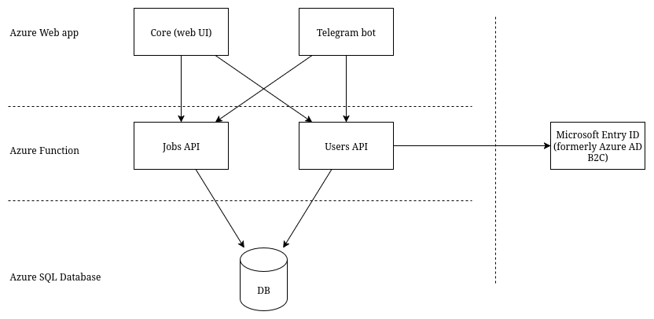

# Ehestifter – Applicant's Application Tracking Service

Ehestifter is a hobby project to explore **Azure cloud services** and **agentic AI workflows** while building something marginally useful:  
a system that scrapes job offerings, normalizes and enriches them, checks user compatibility, and exposes APIs and a lightweight UI.
So far it doesn't scrape or enrich anyting with AI, but we'll getting there. One step at time.

## Features
- Allows you to track applications, pushing them along common statuses
- Tracks dates for you. When did you applied to Amazon SRE role? Is it time to try again?
- Keeps job description for you even if company hid/archived the original.
- Have a simple telegram bot so you can check or change status of the application without opening web UI. You can even add new application through bot, to be edited later when you are back to keyboard.
- (Mostly) survices off free tier options in Azure. With casual use you'll have to pay pennies to host. 

## Future Features
- Scrapers for job offerings from multiple sources
- Data enrichment using LLMs
- Compatibility checks against user profiles & preferences
- Notifications (e.g., via Telegram)
- Archival and analytics of historical job postings

##  Architecture

### Components
- **Azure Functions**  
  - Provide APIs for job offerings, users, and preferences  
  - Run scrapers on triggers (in future)
  - Handle enrichment pipelines  (in future)

- **Azure SQL Database**  
  - Stores structured data: users, preferences, job references  
  - Enforces constraints (duplicate handling, cascade deletes)  

- **Azure Storage (StorageV2)**  
  - Holds user'S CVs for AI functions (blob storage)
  - Archives normalized job postings as **Parquet** for analytics  (in future)

- **Azure Synapse Analytics**  
  - Queries Parquet files directly for reporting and ad-hoc analytics  

- **Web Application (Flask + JS/React frontend)**  
  - Handles authentication (Azure AD B2C)  
  - Provides a user-facing interface for browsing and filtering jobs  
  - Connects to Functions APIs  

### Data Flow
1. **Scrapers** fetch job postings → store raw data.  
2. **Enricher Functions** normalize and enrich with LLM-based metadata.  
3. **Jobs API** exposes enriched data for the frontend and external queries.  
4. **User API** manages authentication, user records, and preference filters.  
5. **UI** lets users log in, see compatible jobs, and set alerts.  
6. **Storage + Synapse** enable historical data analysis.
Only 3-5 exists for now, you are expected to input job applications manually. Still better than sorting auto-replies into subfolders in your email box, eh.

  

## Repository Layout
infrastructure/ # SQL schemas, IaC templates
backend/core/ # Web app that provides UI
backend/jobs/ # jobs API azure function (CRUD jobs, statuses, search and filters for job list)
backend/telegrambot/ # web app that hosts telegram bot
backend/users/ # users API azure function (auth, preferences)
tools/ # simple scripts to help with setup (e.g. generate a list of counrtries and cities to be used in dropdown lists in filters and on create/edit application pages)
docs/ # Diagrams, notes

Each component should have its own `README.md` with setup & deployment details. If it does not - I got distracted, please ping me and I'll help you to setup.

## License
This project is licensed under the [GNU GPL v3](LICENSE).

## Status
This is a work-in-progress hobby project. Expect breaking changes, incomplete features, and frequent experiments.

