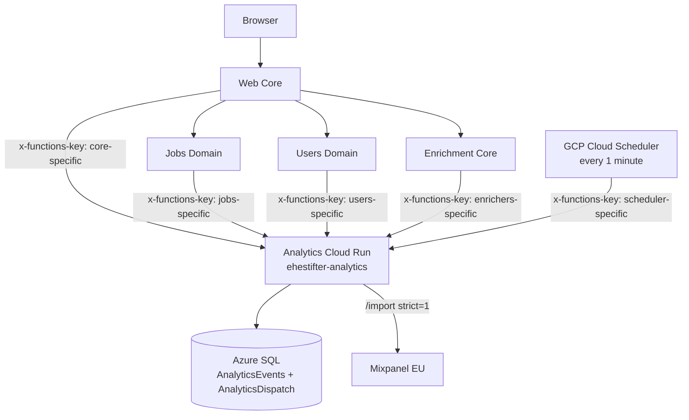

# Milestone: Owned Analytics Event Log with Mixpanel Export

## 1. Goal

Introduce a small analytics pipeline for Ehestifter that:

1. records selected product/user events in Ehestifter-owned storage first,
2. exports those events to Mixpanel server-side in the format Mixpanel expects,
3. can be disabled without code changes,
4. avoids direct browser-to-Mixpanel tracking,
5. avoids external SaaS data-gathering tools other than the explicit Mixpanel export sink,
6. preserves current domain ownership boundaries,
7. keeps cost and operational complexity suitable for the single hobby environment.

The milestone ends when new events generated by real app actions are visible in Mixpanel with stable event names, stable pseudonymous distinct IDs, deterministic `$insert_id` values, and enough properties to support basic Mixpanel reports.

This milestone does **not** end with polished dashboards, insights, reports, or product decisions. Those are follow-up usage tasks after data is flowing.

---

## 2. Context from current system design

Current relevant architecture facts:

* Web Core owns browser presentation and proxy/orchestration, but does not own Jobs, Users, or Enrichment data.
* Users owns user profile, CV, Telegram linking, and user-related state.
* Jobs owns job offerings, job history, user-job statuses, job locations, and compatibility score projections.
* Enrichment Core owns enrichment run lifecycle, run state/history, and projection dispatch.
* Gateway owns worker-facing Service Bus bridge behavior and should not become owner of domain data.
* The system uses Azure SQL as the main relational store.
* Browser traffic that interacts with domain data should go through Web Core proxy routes, not direct domain function calls.
* Analytics / Synapse / Parquet are explicitly not part of the current live architecture and should be treated as future work from a clean slate.
* The system is a single hobby environment with no realistic full staging environment.

Implication for this milestone:

* Do not put durable analytics storage in Web Core.
* Do not let browser JavaScript send events directly to Mixpanel.
* Do not make Mixpanel the source of truth.
* Do not have Analytics directly mutate owner-domain tables.
* Do not make Gateway a general analytics event bus.
* Keep new moving parts minimal.

---

## 3. Main design decision

Add a small **Analytics bounded context** that owns analytics event storage and Mixpanel delivery state.

Proposed component:

```text
backend/analytics
```

Proposed hosting:

```text
GCP Cloud Run service: ehestifter-analytics
```

Storage remains:

```text
Azure SQL Database
```

Runtime auth shape:

```text
x-functions-key checked by the Analytics application before protected route handlers run
```

This intentionally mirrors the current GCP Gateway pattern:

* Cloud Run may be publicly reachable at the platform layer,
* protected routes must enforce application-level `x-functions-key` validation,
* route behavior should be inside the Analytics application, not in client code,
* function keys and Mixpanel credentials live in GCP Secret Manager,
* each distinct producer service gets its own Analytics key; do not reuse the same key across Core, Jobs, Users, Enrichers, scheduler/dispatcher, or any future Telegram producer.

This component owns:

* analytics event ingestion API,
* canonical analytics event table,
* vendor-specific dispatch/outbox state,
* Mixpanel payload mapping,
* Mixpanel delivery retries,
* basic diagnostics endpoints,
* Docker/container runtime for local testing and Cloud Run deployment.

It does not own:

* Jobs business data,
* Users business data,
* Enrichment business data,
* Web UI state,
* Mixpanel dashboards or reports,
* broad data warehouse / Parquet archival.

Reasoning:

* A separate Analytics context preserves the rule that Web Core must not gain domain storage.
* A Dockerized Cloud Run service is easier to test locally before deployment than an Azure Function App.
* An owned event log means Mixpanel receives a copy, not the only data.
* Server-side export avoids embedding Mixpanel SDKs or Mixpanel credentials in the browser.
* A DB-backed outbox gives retry and idempotency without adding Service Bus or another queue just for this milestone.
* Cloud Scheduler can trigger dispatch every minute through a protected HTTP endpoint, avoiding a long-running worker loop.

---

## 4. Non-goals

This milestone does not include:

* Mixpanel browser SDK integration,
* Segment, RudderStack Cloud, Snowplow Cloud, or any other external event collection SaaS,
* self-hosted PostHog / Matomo / RudderStack deployment,
* session replay,
* heatmaps,
* ad attribution,
* cookie consent framework,
* comprehensive event tracking for every click,
* Telegram analytics,
* Synapse or Parquet analytics pipeline,
* Azure Event Hubs,
* Azure Service Bus analytics queue,
* Kafka,
* a new frontend framework,
* analytics-driven product changes,
* dashboards beyond verifying that events are queryable in Mixpanel.

Self-hosted analytics tools may be considered in a future milestone if Mixpanel proves useful but SaaS retention becomes undesirable. They are intentionally not added now.

---

## 5. Resolved decisions and remaining assumptions

Coding agents should not silently change these decisions. If the human operator changes any answer, update this section before implementation.

### 5.1 Resolved decisions

1. **Analytics runtime:** use GCP Cloud Run, not Azure Function App.
2. **Database:** use Azure SQL for owned analytics storage.
3. **Runtime DB identity:** create a separate SQL login/user for Analytics with access restricted to the Analytics tables and required operations only.
4. **Analytics route auth:** use `x-functions-key` style auth inside the Cloud Run app.
5. **Key separation:** store one distinct Analytics key per producer service in GCP Secret Manager. Do not reuse one shared key for all clients.
6. **Mixpanel project residency:** use EU Data Residency.
7. **Mixpanel endpoint:** use `https://api-eu.mixpanel.com`.
8. **Identity in Mixpanel:** use stable pseudonymous `distinct_id`, derived from internal `userId` using HMAC with a secret salt. Do not send raw internal user IDs to Mixpanel.
9. **Product availability wins:** if Analytics ingestion or Mixpanel export fails, normal product actions should still succeed.
10. **Initial tracking scope:** web-only. Do not add Telegram analytics in v1. Telegram can be handled after the Telegram flow refactor.
11. **Company/job names:** do not send company name or job title/name to Mixpanel in v1. They are not considered part of behavior analytics for this milestone.
12. **Provider insight:** provider and provider tenant may be sent when available because they can support behavior analysis such as time between job creation and status changes by application platform.
13. **Location/work-mode insight:** country, city, and remote/on-site properties may be useful. Include them only if already available as normalized structured fields in the Jobs domain at the event source. Do not introduce new location parsing in this milestone.
14. **Raw URL:** do not send raw job URLs to Mixpanel.
15. **Raw external ID:** do not send provider external IDs to Mixpanel by default. Use provider/providerTenant instead.

### 5.2 Remaining assumptions

1. **GCP location:** default to the existing GCP project/region used by the Gateway unless the operator chooses another location.

   ```text
   project: ehestifter-gcp
   region: europe-west3
   service: ehestifter-analytics
   ```

2. **Cloud Run deployment automation:** initial deployment may be manual or GitHub Actions-based. Prefer matching the existing Gateway deployment pattern later, but do not make deployment automation a prerequisite for proving the pipeline.
3. **Cloud Scheduler:** use GCP Cloud Scheduler or an equivalent manual trigger to call the protected dispatch endpoint every minute. If Cloud Scheduler setup is inconvenient during early testing, dispatch can be triggered manually first.
4. **Job creation flow correlation:** precise analysis of “started create job” -> “duplicate checked” -> “created anyway” is easier if the same `correlationId` or `job_create_flow_id` is carried through Core duplicate check and final create. Add this only if it is low-friction in the current routes; otherwise rely on pseudonymous user ID and time-window analysis in v1.
5. **Location property shape:** if Jobs already exposes multiple locations as structured data, prefer arrays such as `location_countries` / `location_cities`. If only one value is cheaply available, use singular properties. If neither is cleanly available, omit location properties in v1 rather than parsing free text.
6. **Work mode property shape:** only emit `work_mode` if the app already has a structured value such as `remote`, `hybrid`, or `onsite`. Do not infer it from job description text.

---

## 6. External Mixpanel constraints to respect

Implementation should use Mixpanel’s server-side `/import` endpoint, not `/track`, because `/import` is recommended for server-side integrations, supports historical events, and supports JSON / ndJSON batches.

Required Mixpanel event shape for `/import`:

```json
{
  "event": "Job Status Changed",
  "properties": {
    "time": 1780000000,
    "distinct_id": "stable-pseudonymous-user-id",
    "$insert_id": "event-guid-or-deterministic-id",
    "schema_version": 1
  }
}
```

Important constraints:

* Send batches of up to 2000 events or 10 MB uncompressed per request.
* Use `strict=1` validation.
* Every exported event must include event name, `time`, `distinct_id`, and `$insert_id`.
* Use `$insert_id` to make retries safe.
* Use gzip if it is easy and already supported by the HTTP client.
* Do not retry permanent validation errors forever.
* Use `https://api-eu.mixpanel.com/import` for the EU Data Residency project.
* For service-account auth, include `project_id` as a query parameter.

Official references checked while preparing this milestone:

* Mixpanel API overview: `https://docs.mixpanel.com/reference/overview`
* Mixpanel Import Events API: `https://docs.mixpanel.com/reference/import-events`
* Mixpanel Track Events API: `https://docs.mixpanel.com/reference/track-event`
* Mixpanel Event Deduplication: `https://docs.mixpanel.com/reference/event-deduplication`
* Mixpanel EU Residency: `https://docs.mixpanel.com/docs/privacy/eu-residency`
* Mixpanel Pricing: `https://mixpanel.com/pricing/`

---

## 7. Proposed high-level flow



Behavior:

1. A product action succeeds in its owner domain or Web Core route.
2. The producer emits a small event envelope to Analytics using its own internal Analytics key.
3. Analytics validates the route key, validates the event, normalizes identity, stores the canonical event, and creates a pending Mixpanel dispatch row.
4. Cloud Scheduler calls the protected dispatch endpoint every 1 minute.
5. The dispatcher reads pending rows, maps them to Mixpanel payloads, and sends batches to `/import?strict=1&project_id=...`.
6. Successful rows are marked `sent`.
7. Temporary failures are retried with backoff.
8. Permanent validation failures are marked `dead` with error details for inspection.

---

## 8. API contracts

### 8.1 Analytics ingest endpoint

Endpoint:

```text
POST /analytics/events
```

Auth:

```text
x-functions-key: <client-specific analytics key>
```

Producer-key rules:

* Core uses the Core Analytics key.
* Jobs uses the Jobs Analytics key.
* Users uses the Users Analytics key.
* Enrichers uses the Enrichers Analytics key.
* Scheduler/dispatch uses a separate Scheduler Analytics key and must not be accepted for normal event ingestion unless explicitly allowed.
* A key should map to an allowed `sourceDomain`. For example, the Jobs key may emit `sourceDomain=jobs`, but not `sourceDomain=users`.
* Never log raw keys.

Producer identity:

* For Web Core calls, include `X-User-Id` when the event is user-attributable.
* For domain producer calls, include `userId` in the event body when the event is user-attributable.
* Do not trust browser-supplied user IDs.

Request body:

```json
{
  "eventName": "Job Status Changed",
  "occurredAtUtc": "2026-06-29T10:15:30.123Z",
  "sourceDomain": "jobs",
  "sourceSurface": "web",
  "userId": "GUID-or-null",
  "subjectType": "job",
  "subjectId": "GUID-or-null",
  "correlationId": "optional-guid-or-request-id",
  "properties": {
    "job_id": "GUID",
    "new_status": "Applied",
    "is_final_status": false,
    "provider": "myworkdayjobs"
  },
  "schemaVersion": 1,
  "producerEventId": "optional-deterministic-id-from-source"
}
```

Response body:

```json
{
  "eventId": "GUID",
  "status": "accepted"
}
```

Validation rules:

* `eventName` is required and must be in the allowlist for v1.
* `occurredAtUtc` is required; default to server receive time only if producer cannot provide it.
* `sourceDomain` is required and must be allowed for the presented key.
* `sourceSurface` is required.
* `schemaVersion` is required and starts at `1`.
* `properties` must be a valid JSON object.
* No property value may contain CV text, job description, email, display name, Telegram account ID, function keys, access tokens, raw link codes, raw job URL, job title/name, or company name.
* Reject events with unknown event names unless `ANALYTICS_ALLOW_UNKNOWN_EVENTS=1` is explicitly set for local testing.

Idempotency:

* If `producerEventId` is provided, Analytics should enforce uniqueness on `(sourceDomain, producerEventId)`.
* If no `producerEventId` is provided, Analytics generates a new `eventId`.
* Mixpanel `$insert_id` should be the canonical `eventId` string or a deterministic 36-character identifier derived from `(sourceDomain, producerEventId)`.

### 8.2 Analytics dispatch endpoint

Endpoint:

```text
POST /analytics/dispatch/run
```

Auth:

```text
x-functions-key: <scheduler-specific analytics key>
```

Purpose:

* Called by GCP Cloud Scheduler every 1 minute.
* May also be called manually by the operator during early validation.
* Performs one bounded dispatch cycle and returns counters.

Example response:

```json
{
  "attempted": 10,
  "sent": 9,
  "retry": 1,
  "dead": 0
}
```

Rules:

* Do not run forever inside the request.
* Use a bounded batch size.
* Do not allow producer keys to call this endpoint.
* Do not allow the scheduler key to spoof normal producer events unless explicitly configured for local testing.

### 8.3 Analytics diagnostics endpoint

Endpoint:

```text
GET /analytics/dispatch/status
```

Auth:

```text
x-functions-key: <operator or scheduler analytics key>
```

Purpose:

Return small operational counters, not full event payloads.

Example response:

```json
{
  "collectionEnabled": true,
  "mixpanelExportEnabled": true,
  "pending": 3,
  "sentLast24h": 42,
  "failedRetryable": 1,
  "dead": 0,
  "lastSuccessfulDispatchAtUtc": "2026-06-29T10:15:30Z"
}
```

---

## 9. Storage model

### 9.1 `dbo.AnalyticsEvents`

Purpose:

Canonical, owned event log.

Proposed columns:

| Column | Type | Notes |
|---|---:|---|
| `EventId` | `uniqueidentifier` | Primary key; also usable as Mixpanel `$insert_id` |
| `OccurredAtUtc` | `datetime2(3)` | Event time used for Mixpanel `time` |
| `ReceivedAtUtc` | `datetime2(3)` | Analytics service receive time |
| `SourceDomain` | `nvarchar(40)` | v1: `core`, `jobs`, `users`, `enrichers` |
| `SourceSurface` | `nvarchar(40)` | v1: `web`, `worker`, `timer`, `system`; no `telegram` in v1 |
| `UserId` | `uniqueidentifier null` | Internal user ID retained only in owned DB |
| `DistinctId` | `nvarchar(128) null` | Pseudonymous Mixpanel distinct ID, derived from `UserId` |
| `EventName` | `nvarchar(80)` | Allowlisted event name |
| `SubjectType` | `nvarchar(40) null` | `job`, `cv`, `enrichment_run`, etc. |
| `SubjectId` | `nvarchar(80) null` | GUID or source-specific ID string |
| `CorrelationId` | `nvarchar(100) null` | Request/run/create-flow correlation breadcrumb |
| `ProducerEventId` | `nvarchar(120) null` | Optional source idempotency key |
| `SchemaVersion` | `int` | Start with `1` |
| `PropertiesJson` | `nvarchar(max)` | Sanitized event properties |

Indexes:

* primary key on `EventId`,
* index on `(OccurredAtUtc)`,
* index on `(UserId, OccurredAtUtc)`,
* unique filtered index on `(SourceDomain, ProducerEventId)` where `ProducerEventId is not null`,
* index on `(EventName, OccurredAtUtc)`.

### 9.2 `dbo.AnalyticsDispatch`

Purpose:

Vendor-specific delivery state. Keeps Mixpanel coupling out of the canonical event table.

Proposed columns:

| Column | Type | Notes |
|---|---:|---|
| `DispatchId` | `uniqueidentifier` | Primary key |
| `EventId` | `uniqueidentifier` | FK to `AnalyticsEvents` |
| `Sink` | `nvarchar(40)` | v1 only: `mixpanel` |
| `Status` | `nvarchar(20)` | `pending`, `sending`, `sent`, `retry`, `dead`, `disabled` |
| `AttemptCount` | `int` | Starts at `0` |
| `NextAttemptAtUtc` | `datetime2(3)` | For backoff |
| `LastAttemptAtUtc` | `datetime2(3) null` | Diagnostics |
| `SentAtUtc` | `datetime2(3) null` | Set on success |
| `LastErrorCode` | `nvarchar(80) null` | HTTP status or validation marker |
| `LastErrorJson` | `nvarchar(max) null` | Truncated response/error detail |

Indexes:

* unique index on `(Sink, EventId)`,
* index on `(Sink, Status, NextAttemptAtUtc)`,
* index on `(Status, LastAttemptAtUtc)`.

Retention:

* Do not implement deletion retention in this milestone.
* Add a comment/TODO that future retention may be needed after the data volume is understood.

### 9.3 Analytics SQL user and permissions

Add an explicit DB setup step for a dedicated Analytics runtime user.

Intent:

* Analytics runtime should not use a broad app/admin SQL login.
* Analytics runtime should not be able to read or write Jobs, Users, Enrichment, or other domain tables.
* Migration/setup can use an operator/admin connection; runtime should use the restricted connection.

Minimum runtime permissions after tables exist:

* `SELECT`, `INSERT`, and `UPDATE` on `dbo.AnalyticsEvents`.
* `SELECT`, `INSERT`, and `UPDATE` on `dbo.AnalyticsDispatch`.
* No `DELETE` permission by default.
* No permissions on other domain tables.

Implementation notes:

* If helper stored procedures are introduced later, grant `EXECUTE` only on those procedures instead of broad table permissions.
* If the migration system cannot easily create users/logins, document the manual SQL commands in operator notes.
* Store the restricted runtime connection string in GCP Secret Manager for Cloud Run.

---

## 10. Configuration

Environment variables / secrets for `backend/analytics` on Cloud Run:

```env
ANALYTICS_COLLECTION_ENABLED="1"
ANALYTICS_MIXPANEL_EXPORT_ENABLED="0"
ANALYTICS_DISTINCT_ID_SALT="<Secret Manager: analytics-distinct-id-salt>"
ANALYTICS_SQL_CONNECTION_STRING="<Secret Manager: analytics-sql-connection-string-restricted-user>"

ANALYTICS_KEY_CORE="<Secret Manager: analytics-key-core>"
ANALYTICS_KEY_JOBS="<Secret Manager: analytics-key-jobs>"
ANALYTICS_KEY_USERS="<Secret Manager: analytics-key-users>"
ANALYTICS_KEY_ENRICHERS="<Secret Manager: analytics-key-enrichers>"
ANALYTICS_KEY_SCHEDULER="<Secret Manager: analytics-key-scheduler>"
ANALYTICS_KEY_OPERATOR="<Secret Manager: analytics-key-operator-optional>"

MIXPANEL_PROJECT_ID="<project id>"
MIXPANEL_API_BASE_URL="https://api-eu.mixpanel.com"
MIXPANEL_SERVICE_ACCOUNT_USERNAME="<Secret Manager: mixpanel-service-account-username>"
MIXPANEL_SERVICE_ACCOUNT_PASSWORD="<Secret Manager: mixpanel-service-account-password>"
MIXPANEL_STRICT="1"
MIXPANEL_BATCH_SIZE="500"
MIXPANEL_MAX_ATTEMPTS="8"
```

Producer env vars in Web Core / Jobs / Users / Enrichers as needed:

```env
ANALYTICS_BASE_URL="https://ehestifter-analytics-<hash>-ew.a.run.app"
ANALYTICS_FUNCTION_KEY="<service-specific analytics key>"
ANALYTICS_COLLECTION_ENABLED="1"
ANALYTICS_EMIT_TIMEOUT_SECONDS="2"
```

Cloud Scheduler configuration:

```text
method: POST
url: https://<analytics-cloud-run-url>/analytics/dispatch/run
header: x-functions-key: <scheduler-specific analytics key>
schedule: every 1 minute
```

Rules:

* `ANALYTICS_MIXPANEL_EXPORT_ENABLED=0` stops sending to Mixpanel while continuing to collect owned events.
* `ANALYTICS_COLLECTION_ENABLED=0` stops accepting/storing new analytics events.
* Producers should also respect `ANALYTICS_COLLECTION_ENABLED=0` to avoid unnecessary HTTP calls.
* Never log Mixpanel service account password, function keys, or salts.
* Do not put Mixpanel credentials, service account credentials, or project token into browser JavaScript.
* Do not duplicate GCP runtime secrets into GitHub Actions.

---

## 11. Initial event taxonomy

This is deliberately small. Add events only when the source action is already clear in the system design or already durable in domain history.

### 11.1 Event naming rules

* Use human-readable Title Case event names in Mixpanel.
* Keep the number of unique event names small.
* Use properties for variable context.
* Event names are case-sensitive. Do not add spelling variants.
* Prefer stable domain facts over noisy UI clicks.
* Do not add Telegram events in v1.

### 11.2 v1 event allowlist

| Event name | Source owner | Source surface | Trigger | Required properties | Notes |
|---|---|---|---|---|---|
| `Job Creation Started` | Core | `web` | User opens the job creation interface/page | none | This captures users who start but later abandon creation. |
| `Job Duplicate Checked` | Core | `web` | Existing duplicate check runs after job URL blur/proxy call | `duplicate_found`; optional `provider`, `provider_tenant`, optional `identity_inferred` | Do not send raw URL or external ID. Useful for duplicate false-positive/abandonment analysis. |
| `Job List Viewed` | Core | `web` | Main job list route returns successfully | optional `category`, optional `page` | Route-level view, not browser SDK. |
| `Job Detail Viewed` | Core | `web` | Job detail route returns successfully | `job_id` | Route-level view. |
| `Job Search Performed` | Core | `web` | Existing server-side search/filter request executes | optional `category`, `has_search_term` | Do not send raw search term in v1. |
| `Job Created` | Jobs | `web` | Job create succeeds | `job_id`, `creation_source`; optional `provider`, optional `provider_tenant`, optional `dedupe_result`, optional normalized location/work-mode properties | Do not send raw URL, external ID, title, company, or description. |
| `Job Creation Failed` | Jobs | `web` | Job create fails after a real create attempt reaches Jobs | `failure_kind`; optional `provider`, optional `provider_tenant` | Include safe enum-like failure reason, for example `duplicate_insert_race`, `validation_failed`, `unknown`. Do not send raw exception text. |
| `Job Updated` | Jobs | `web` | Job update succeeds | `job_id`; optional normalized location/work-mode properties | Do not send job description, title, or company name. |
| `Job Deleted` | Jobs | `web` | Logical delete succeeds | `job_id` | Delete is logical, not physical. |
| `Job Status Changed` | Jobs | `web` | Status update succeeds | `job_id`, `new_status`, `is_final_status` | Use canonical status constants. |
| `CV Updated` | Users | `web` | CV/preferences update succeeds | `cv_version_id` if available | Do not send CV text, CV length, name, or email. |
| `Compatibility Requested` | Enrichers | `web` | Compatibility run is created/requested from web flow | `job_id`, `run_id`, `enricher_type` | No prompt/CV/job description. |
| `Compatibility Completed` | Enrichers | `worker` | Run reaches success terminal state | `job_id`, `run_id`, `enricher_type`, `score` | No summary text in Mixpanel. |
| `Compatibility Failed` | Enrichers | `worker` or `timer` | Run reaches failure terminal state | `job_id`, `run_id`, `enricher_type`, optional `failure_stage` | No exception body by default. |

Optional normalized location/work-mode properties, only when already available as structured values:

```text
location_country
location_city
location_countries
location_cities
work_mode
```

Do not add new parsing logic only to populate these analytics fields.

### 11.3 Deferred events

Defer these until real need is shown in Mixpanel:

* Telegram events,
* fine-grained click tracking,
* raw search terms,
* job title/company breakdowns,
* CV editor interaction events,
* session duration,
* anonymous pre-login events,
* detailed error payloads,
* scraper events.

---

## 12. Privacy and security rules

Do not send these fields to Mixpanel:

* email,
* display name,
* raw internal `userId`,
* Telegram account ID,
* Telegram username,
* CV plaintext,
* CV Quill Delta,
* CV length,
* job title/name,
* company name,
* job description,
* compatibility summary text,
* raw link code,
* function keys,
* access tokens,
* raw session cookie values,
* full job URL,
* provider external ID by default,
* raw exception text.

Allowed by default:

* pseudonymous `distinct_id`,
* job GUID,
* run GUID,
* CV version GUID,
* status name from canonical constants,
* provider/providerTenant if already stored and not sensitive,
* normalized country/city/work-mode if already structured,
* score numeric value for compatibility completion.

Sanitization should happen inside Analytics before persistence and before Mixpanel export. Producers should still avoid sending unsafe fields, but Analytics must be the final guard.

---

## 13. Producer integration guidance

### 13.1 Web Core

Web Core may emit route-level UX events after successful route handling:

* `Job Creation Started`,
* `Job Duplicate Checked`,
* `Job List Viewed`,
* `Job Detail Viewed`,
* `Job Search Performed`.

Rules:

* Do not add durable storage to Web Core.
* Do not call Mixpanel from browser JavaScript.
* Do not expose Analytics Cloud Run directly to browser JavaScript.
* Use existing authenticated session and `X-User-Id` extraction path.
* Keep the analytics HTTP call short-timeout and best-effort.
* For `Job Duplicate Checked`, emit after the existing duplicate check proxy/domain call returns.
* For `Job Creation Started`, emit when the create interface/page is served, not on every field focus.
* If cheap, carry a `correlationId` or `job_create_flow_id` through `Job Creation Started`, `Job Duplicate Checked`, and final create. Do not make this correlation requirement block the milestone.

### 13.2 Jobs domain

Jobs should emit successful domain facts and safe failure facts:

* `Job Created`,
* `Job Creation Failed`,
* `Job Updated`,
* `Job Deleted`,
* `Job Status Changed`.

Rules:

* Emit success events after the owner-domain write succeeds.
* Emit `Job Creation Failed` only after a real create attempt reaches Jobs and fails. Do not emit for client-side form validation that never reaches Jobs.
* Use safe enum-like `failure_kind` values. Do not send SQL exception text, validation body text, raw URL, title, company, or description.
* Use canonical status constants for status values.
* Prefer deterministic `producerEventId` based on existing history/status row ID if such an ID exists in code.
* If no durable source row ID is available, use generated event ID and accept no replay idempotency for that event.
* Do not change job deduplication identity for analytics.
* Do not add Telegram-originated event emission in v1. If the same Jobs endpoint is used by Telegram, skip analytics for `sourceSurface=telegram` until the Telegram analytics milestone.

### 13.3 Users domain

Users should emit successful web-domain facts:

* `CV Updated`.

Rules:

* Do not send CV text, CV length, or Quill Delta.
* Do not send email/name/Telegram account ID.
* If CV version ID exists, include it.
* Do not add `Telegram Linked` / `Telegram Unlinked` events in v1.

### 13.4 Enrichment Core

Enrichment Core should emit lifecycle facts connected to the web compatibility flow:

* `Compatibility Requested`,
* `Compatibility Completed`,
* `Compatibility Failed`.

Rules:

* Do not send worker prompt, CV text, job description, job title, company name, or compatibility summary.
* Include score only on successful completion.
* Include failure stage only if already available as a safe enum-like value.
* Do not route analytics through Gateway.

### 13.5 Telegram Bot

Telegram analytics is explicitly deferred.

Rules:

* Do not add bot-only analytics events in v1.
* If Jobs/Users endpoints are shared between web and Telegram, ensure v1 instrumentation can avoid or skip Telegram-originated events.
* Revisit Telegram analytics after the Telegram flow refactor.

---

## 14. Mixpanel export mapping

For each stored `AnalyticsEvents` row:

```json
{
  "event": "<EventName>",
  "properties": {
    "time": 1780000000,
    "distinct_id": "<DistinctId>",
    "$insert_id": "<EventId>",
    "schema_version": 1,
    "source_domain": "jobs",
    "source_surface": "web",
    "subject_type": "job",
    "subject_id": "<SubjectId>",
    "job_id": "<job_id from PropertiesJson>",
    "new_status": "Applied",
    "provider": "myworkdayjobs"
  }
}
```

Rules:

* Convert `OccurredAtUtc` to Unix timestamp seconds or milliseconds consistently. Prefer seconds unless codebase already has a timestamp helper.
* Set `ip` to `0` if needed to avoid Mixpanel deriving location from the Analytics Cloud Run IP instead of the real user. Do not send user IP in v1.
* Drop `UserId` before export.
* Drop null properties.
* Ensure `$insert_id` is 36 characters or fewer. A GUID string is acceptable.
* Batch by pending dispatch rows ordered by `OccurredAtUtc`.

---

## 15. Failure behavior

### 15.1 Analytics ingestion failure

Producer behavior:

* product action succeeds or fails based on owner-domain result, not analytics result,
* analytics HTTP call uses short timeout,
* analytics failure logs warning with event name, source domain, subject id, and error type,
* no function keys or payloads with sensitive data in logs.

Known compromise:

* Some events may be missed if Analytics is down and no owner-domain durable history replay is implemented. Existing Jobs and Enrichment histories reduce this risk for core facts but do not automatically repair it in v1.

### 15.2 Mixpanel export failure

Analytics behavior:

* 429, 502, 503, network timeouts: mark retry with exponential backoff and jitter.
* 400 with validation details: mark invalid records as `dead`, store truncated error JSON, do not retry forever.
* 401/403: pause exports by marking retry/dead according to implementation simplicity and surface via diagnostics.
* Export disabled: leave dispatch rows pending or mark `disabled`; prefer pending so enabling export later resumes.

---

## 16. Phase plan

### Phase 0 — Confirm Mixpanel, GCP, and secrets manually

Human/operator tasks:

1. Create or choose Mixpanel EU Data Residency project.
2. Create service account with the minimum role that can import events. Mixpanel docs say `/import` requires Owner or Admin service account; if this is too broad for comfort, document the limitation.
3. Record project ID.
4. Confirm GCP project/region for Analytics Cloud Run, defaulting to existing Gateway project/region if acceptable.
5. Create or plan GCP Secret Manager secrets for Mixpanel credentials, Analytics distinct ID salt, client-specific Analytics keys, scheduler key, and Azure SQL restricted connection string.
6. Do not put credentials in repo.

Acceptance criteria:

* Project ID known.
* API base URL known: `https://api-eu.mixpanel.com`.
* GCP project/region/service name known.
* Service account credentials available only as environment secrets.
* Client-specific Analytics keys are planned and not shared across services.

### Phase 1 — Analytics service skeleton, schema, and DB user

Tasks:

1. Add `backend/analytics` as a small Dockerized HTTP service suitable for local container testing and Cloud Run deployment.
2. Add SQL migration for `dbo.AnalyticsEvents` and `dbo.AnalyticsDispatch`.
3. Add explicit DB setup/operator note for a separate Analytics SQL login/user.
4. Grant the Analytics runtime SQL user only the required permissions on `dbo.AnalyticsEvents` and `dbo.AnalyticsDispatch`.
5. Add config loader for analytics env vars/secrets.
6. Add `x-functions-key` style auth with distinct accepted keys per client service.
7. Add `/analytics/events` ingest endpoint.
8. Add allowlist validation for v1 event names.
9. Add sanitization guard for forbidden property names.
10. Add diagnostics endpoint.
11. Build and run the container locally against a safe test/dev configuration or manually controlled DB target.

Acceptance criteria:

* Service can run locally as a Docker container.
* Service can accept a valid test event and store it.
* Runtime SQL connection uses the restricted Analytics user, not an admin or broad app login.
* Restricted SQL user cannot read/write non-Analytics domain tables.
* Invalid event name is rejected.
* Forbidden field names are rejected or dropped according to clear implementation choice.
* Dispatch row is created for Mixpanel sink when export is configured.
* No Mixpanel call is made yet if export is disabled.

### Phase 2 — Mixpanel dispatcher and Cloud Scheduler trigger

Tasks:

1. Add protected `POST /analytics/dispatch/run` endpoint.
2. Read pending dispatch rows.
3. Map stored events to Mixpanel `/import` payload.
4. Send batches with `strict=1` and service-account auth.
5. Mark success/failure states.
6. Implement retry/backoff for temporary failures.
7. Add structured logs that do not include secrets.
8. Configure Cloud Scheduler to call the dispatch endpoint every 1 minute with the scheduler-specific key.
9. Keep manual dispatch invocation possible for early validation.

Acceptance criteria:

* A stored test event appears in Mixpanel Events view.
* Re-running dispatch does not duplicate reports because `$insert_id` is stable.
* 400 validation response stores useful diagnostics.
* Turning `ANALYTICS_MIXPANEL_EXPORT_ENABLED=0` stops outbound Mixpanel calls.
* Producer keys cannot call the dispatch endpoint.

### Phase 3 — Web Core route-level events

Tasks:

1. Add small analytics client helper in Web Core.
2. Emit `Job Creation Started` when the job creation interface/page is opened.
3. Emit `Job Duplicate Checked` when the duplicate check flow runs after job URL blur/proxy call.
4. Emit `Job List Viewed` from existing job list route.
5. Emit `Job Detail Viewed` from existing job detail route.
6. Emit `Job Search Performed` only where there is already a server-side search/filter request.
7. Use `X-User-Id` from existing authenticated session path.
8. If cheap, preserve a shared `correlationId` / `job_create_flow_id` across create-start, duplicate-check, and create-submit.

Acceptance criteria:

* Browser never receives Mixpanel token or service account credential.
* Browser never calls Analytics Cloud Run directly.
* Events are attributed to pseudonymous Mixpanel user IDs.
* Page/action route still works if Analytics is disabled or down.
* Duplicate check event does not include raw URL or external ID.

### Phase 4 — Jobs domain web events

Tasks:

1. Add analytics client helper in Jobs domain or shared internal helper if one already exists for function-to-function calls.
2. Emit `Job Created` after successful web create.
3. Emit `Job Creation Failed` after failed web create attempts that reach Jobs.
4. Emit `Job Updated` after successful web update.
5. Emit `Job Deleted` after successful logical delete.
6. Emit `Job Status Changed` after successful status append.
7. Use canonical status constants for `new_status` and `is_final_status`.
8. Include provider/providerTenant when available.
9. Include normalized country/city/work-mode only if already cheaply available as structured values.

Acceptance criteria:

* Web-originated events are captured.
* Telegram-originated events are not added in v1.
* Events do not include job description, raw URL, external ID, title, company, email, or name.
* Existing Jobs API contracts continue to work.

### Phase 5 — Users and Enrichment events

Tasks:

1. Users emits `CV Updated` after successful web CV/preferences update.
2. Enrichment Core emits `Compatibility Requested`, `Compatibility Completed`, `Compatibility Failed` at lifecycle transitions connected to web-triggered compatibility runs.
3. Enrichment events include IDs and score only; no prompt, CV, job description, job title, company, or summary.

Acceptance criteria:

* CV update produces a Mixpanel event without CV content or CV length.
* Compatibility request/completion can be used as a funnel in Mixpanel.
* No Telegram link/unlink analytics are added in v1.

### Phase 6 — Validation and handoff notes

Tasks:

1. Run manual action set:
   * open job creation interface,
   * trigger duplicate check with a known non-duplicate URL,
   * trigger duplicate check with a known duplicate URL if practical,
   * open job list,
   * open job detail,
   * create job,
   * attempt a job create failure if safe/practical,
   * update status,
   * update CV,
   * request compatibility,
   * complete or observe one compatibility run.
2. Inspect Analytics SQL rows.
3. Inspect Analytics dispatch status.
4. Inspect Mixpanel Events view.
5. Document exact event names and properties observed.
6. Add short operator note explaining how to disable Mixpanel export and analytics collection.
7. Add short operator note explaining where Cloud Run secrets and Cloud Scheduler trigger live.

Acceptance criteria:

* At least one event from Core, Jobs, Users, and Enrichment appears in owned storage.
* At least one event from Core, Jobs, Users, and Enrichment appears in Mixpanel, unless a source cannot be triggered manually; if not triggered, document why.
* No forbidden PII fields are visible in Mixpanel event JSON.
* Export can be disabled by env var without code change.
* Collection can be disabled by env var without code change.
* Analytics Cloud Run can be deployed/disabled independently from the existing product services.

---

## 17. Suggested implementation order for coding agent

Start narrow:

1. Create Analytics service + schema + restricted DB user instructions.
2. Run Analytics service locally as a Docker container.
3. Implement Mixpanel dispatch with one manually inserted test event.
4. Deploy Cloud Run / configure secrets / configure scheduler only after local container behavior is understood.
5. Wire Web Core `Job Creation Started` and `Job Duplicate Checked` events.
6. Wire Jobs status-change event.
7. Validate end-to-end.
8. Only then add the remaining event producers.

Do not start by adding event calls everywhere. First prove the pipeline, auth, DB permission, and privacy guardrail.

---

## 18. Testing and validation guidance

Expected lightweight tests:

* unit test event validation,
* unit test forbidden-property sanitization/rejection,
* unit test sourceDomain/key authorization,
* unit test distinct ID HMAC stability,
* unit test Mixpanel payload mapping,
* unit test retry classification for 400/401/429/502/503,
* SQL migration smoke check if current repo has a migration test pattern,
* DB permission smoke check for restricted Analytics runtime user.

Manual validation:

* run the Analytics container locally,
* send a valid test event with a test key,
* try sending an event with the wrong key/sourceDomain pairing,
* use Mixpanel Events view to inspect raw events,
* filter by one known pseudonymous distinct ID,
* verify property names and types,
* verify event names match allowlist exactly,
* verify no PII/free text leaked,
* verify Analytics runtime SQL user cannot read non-Analytics tables.

Do not create a large new test framework in this milestone.

---

## 19. System design update after milestone completion

After implementation stabilizes, update `system-design.md` with:

* new Analytics component in component inventory and architecture diagram,
* Analytics bounded context ownership,
* Analytics Cloud Run hosting model,
* Analytics `x-functions-key` auth shape and per-client key separation,
* Analytics SQL tables,
* restricted Analytics SQL runtime user expectation,
* Analytics internal API contract,
* producer responsibilities by domain,
* Mixpanel export configuration and disable switch,
* Cloud Scheduler dispatch trigger,
* privacy rules for exported event properties,
* statement that Mixpanel is an external analysis sink, not source of truth.

---

## 20. Whole-milestone acceptance criteria

The milestone is complete when:

1. Ehestifter stores analytics events in its own Azure SQL tables.
2. Analytics runtime uses a restricted SQL user with only required permissions on Analytics tables.
3. Analytics runs as a Dockerized GCP Cloud Run service.
4. Analytics protected routes enforce `x-functions-key` style auth.
5. Distinct producer services use distinct Analytics keys.
6. Mixpanel receives events from server-side export, not browser SDK calls.
7. Mixpanel export can be disabled by environment variable.
8. Analytics collection can be disabled by environment variable.
9. Events have stable names and a documented v1 taxonomy.
10. Events have stable pseudonymous `distinct_id` values.
11. Events have deterministic `$insert_id` values suitable for retries.
12. No CV text, CV length, job descriptions, job titles/names, company names, emails, display names, Telegram IDs, tokens, function keys, raw job URLs, raw external IDs, raw link codes, or raw exception text are visible in Mixpanel.
13. At least the following actions are represented in Mixpanel if manually triggerable:
   * job creation started,
   * job duplicate checked,
   * job list viewed,
   * job detail viewed,
   * job created,
   * job creation failed,
   * job status changed,
   * CV updated,
   * compatibility requested,
   * compatibility completed or failed.
14. Existing product actions continue to succeed if Analytics is disabled.
15. `system-design.md` is updated after the milestone becomes steady-state.

---

## 21. Known compromises

* The v1 pipeline does not guarantee perfect capture if Analytics ingestion is unavailable immediately after a domain write. This is accepted to avoid making analytics a hard dependency for product actions.
* No warehouse/Parquet export is included. Owned SQL event storage is enough for this milestone.
* No self-hosted analytics UI is included. Mixpanel is the exploratory UI for this milestone.
* No anonymous pre-login tracking is included. This keeps identity simple and avoids accidental browser tracking scope creep.
* No full raw URL/search-term tracking is included. This avoids leaking user intent or sensitive data before a clearer reporting need exists.
* No Telegram analytics is included. Telegram event design should wait until after Telegram flow refactor.
* If no durable replay is added, some failed analytics calls may cause lost analytics events. This is accepted in v1 to preserve product availability and simplicity.

---

## 22. First next step

Before coding, confirm the GCP project/region/service name and create the initial secrets plan:

```text
GCP_PROJECT=ehestifter-gcp
GCP_REGION=europe-west3
ANALYTICS_SERVICE_NAME=ehestifter-analytics
MIXPANEL_API_BASE_URL=https://api-eu.mixpanel.com
ANALYTICS_MIXPANEL_EXPORT_ENABLED=0
```

Then implement Phase 1 with export disabled, insert one test event, and inspect owned SQL storage using the restricted Analytics runtime user before sending anything to Mixpanel.