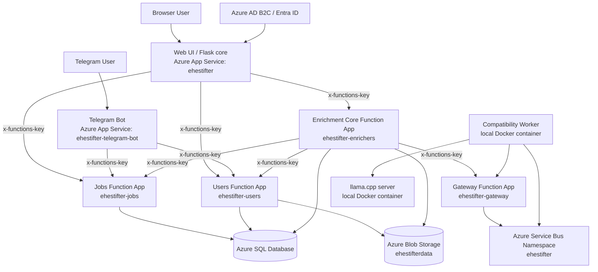

# Ehestifter System Design

Status: current `as-is` system design  
Audience: coding agents working on the repo, with enough detail for a human operator to follow  
Primary goal: enable safe feature work without guessing, duplicating existing services, or bypassing ownership boundaries

---

## 1. Purpose and usage model

This document is the master design reference for the Ehestifter system as it exists today.

It is intentionally written for AI-assisted development:
- to help an agent find the correct component to modify,
- to make existing services and APIs visible before the agent invents replacements,
- to document ownership boundaries and invariants,
- to reduce accidental cross-domain DB changes,
- to encode operational constraints that are easy to miss from code alone.

This document describes the system **as implemented now**. It is not a wishlist. Near-term planned behavior should normally live in a separate milestone document during implementation, then be merged back into this file when the milestone is complete.

### 1.1 How agents should use this document

For frontier models with large context, this file can be used directly.

For smaller-context or local models, do **not** feed the full file blindly into every task. Use this process instead:

1. Identify the feature or defect area.
2. Extract only the relevant sections from this document.
3. Add only the code files directly involved.
4. Ask for clarification before any hazardous DB or cross-domain write change.

Recommended extraction targets:
- UI work: sections on Web UI, Jobs API used by UI, auth/trust boundaries, operational constraints.
- Telegram work: Telegram bot, Users telegram-link endpoints, Jobs telegram endpoints.
- Enrichment work: Enrichment Core, Gateway, Compatibility worker, Jobs projection contract, Users CV snapshot contract.
- DB-affecting work: domain ownership, canonical data model, invariants, API contracts, and relevant migration SQL.

### 1.2 Documentation strategy

Current preferred documentation shape:
- one master system document for the whole platform,
- temporary milestone design docs for ongoing medium-sized changes,
- merge milestone docs into this file once the milestone is implemented and stabilized.

This keeps chat-based workflows simple while still allowing iteration during longer implementation arcs.

---

## 2. System overview

Ehestifter is an applicant's application tracking system built to experiment with Azure services and agentic AI workflows on a hobby budget.

Current implemented system areas:
- web UI for users,
- Users domain,
- Jobs domain,
- Telegram bot,
- enrichment subsystem for compatibility scoring,
- local inference stack for compatibility worker.

### 2.1 High-level goals

Current practical goals:
- keep a shared store of job postings,
- allow each user to track their own status against a shared job,
- allow each user to maintain a CV for later enrichment,
- compute compatibility scores for `(jobId, userId)`,
- expose those scores in UX without recomputing on every page load,
- keep the system cheap and simple enough to operate without managed enterprise tooling.

### 2.2 High-level component map



### 2.3 Component inventory and deployment topology

| Component | Purpose | Hosting |
|---|---|---|
| `backend/core` | Web UI, proxy endpoints, presentation layer | Azure App Service `ehestifter` |
| `backend/telegrambot` | Telegram UX and command handling | Azure App Service `ehestifter-telegram-bot` |
| `backend/jobs` | Jobs domain API and job-related storage ownership | Azure Function App `ehestifter-jobs` |
| `backend/users` | Users domain API and user-related storage ownership | Azure Function App `ehestifter-users` |
| `backend/enrichers` | Enrichment Core, run lifecycle, snapshot building, projection dispatch | Azure Function App `ehestifter-enrichers` |
| `backend/gateway` | Worker-facing APIs and Service Bus bridge | Azure Function App `ehestifter-gateway` |
| `workers/compatibility` | Polls work, builds prompts, performs compatibility inference | Local Docker container `compatibility-worker` |
| `infrastructure/docker/llama.cpp` | Local inference server | Local Docker container `llama-server` |
| Azure Service Bus | Queue transport for enrichment requests | Azure namespace `ehestifter` |
| Azure SQL | Main relational storage | Azure SQL server `eperidbserver` |
| Azure Blob Storage | CV and enrichment snapshot blob storage | Storage account `ehestifterdata` |
| Azure AD B2C / Entra ID | Browser auth | Azure-managed |
| GitHub Actions | CI/CD for Azure-hosted services | GitHub-hosted |

### 2.4 Environment model

The system is effectively single-environment.

Constraints:
- one shared hobby environment,
- one resource group in one subscription,
- no realistic support for multiple Azure environments on current budget/free tiers.

Implication for agents:
- changes should be incremental,
- migrations and config changes should be conservative,
- avoid large refactors that assume a staging environment exists.

---

## 3. Architecture principles and non-goals

### 3.1 Principles

1. **Domain ownership is real.** Each domain owns its own tables and write model.
2. **Use APIs across domains.** Do not directly update another domain's tables.
3. **Keep it simple.** Avoid introducing new frameworks or infrastructure unless they materially simplify the service.
4. **Preserve operability without advanced AI providers.** The owner should be able to operate and improve the system even without frontier hosted inference.
5. **Assume cold starts.** Retries, timeouts, and UI blocking/unblocking patterns are part of the architecture, not incidental implementation detail.
6. **Prefer consistency of shape over novelty.** New functions and routes should resemble existing ones.

### 3.2 Non-goals

These are not current goals and agents should not optimize for them unless explicitly asked:
- multi-environment Azure architecture,
- enterprise-grade IAM inside every function endpoint,
- event-sourced redesign of domains,
- rich frontend SPA framework migration,
- direct browser access to domain functions,
- scrapers productionization,
- analytics / Synapse / Parquet pipeline.

---

## 4. Authentication, identity, and trust boundaries

### 4.1 Browser authentication

Browser users authenticate through Azure AD B2C / Entra ID.

The authenticated session is stored in Flask session cookie state in `backend/core`. There is no persistent session storage for this. On app restart, the session must be re-established.

### 4.2 Internal service authentication

Internal service-to-service calls use the `x-functions-key` header.

This is the practical trust boundary in the current system:
- domain function apps do not perform their own user-facing auth validation inside endpoints,
- access is controlled by being behind function/web app surfaces that require platform-level credentials,
- web users should not call Jobs/Users/Enrichers/Gateway directly.

### 4.3 Canonical user identity

Canonical internal user identity is carried as `X-User-Id`.

The web UI extracts it from session, then sends it to downstream domains. Jobs and Users treat that user ID as the caller identity.

Important implication:
- if a feature needs user identity in Jobs or Users, it should usually arrive via `X-User-Id` through the existing proxy/orchestration path rather than by inventing a new identity system.

### 4.4 Telegram identity

Telegram users are linked to Ehestifter users through Users-domain link code flow.

After link:
- telegram account is resolved to internal user by bot logic via Users domain,
- bot then calls Jobs and Users APIs with function key auth,
- no separate per-request auth is performed inside Jobs or Users for Telegram-originated calls.

### 4.5 Worker and inference trust model

Compatibility worker and llama.cpp do not expose user-reachable public interfaces.

Current assumptions:
- compatibility worker is trusted local infrastructure,
- llama.cpp is deployed in a relatively safe environment and currently unauthenticated,
- worker accesses Gateway and Service Bus, not domain DBs.

---

## 5. Bounded contexts and ownership

This section is the most important guardrail for future work.

### 5.1 Web UI (`backend/core`)

Owns:
- HTML templates,
- CSS and browser JS used by the web UI,
- presentation logic,
- proxy/orchestration routes under `backend/core/routes/ui_*`,
- retry and timeout handling at the UI interaction level,
- client-visible state transitions such as disabled buttons and intermediate placeholders.

Does not own:
- Jobs data,
- Users data,
- Enrichment run data,
- domain business rules unless there is a very strong reason.

Rules:
- do not add domain storage into core,
- do not let the browser call function apps directly,
- keep core mostly stateless except session and presentation concerns.

### 5.2 Users domain (`backend/users`)

Owns:
- initial creation of internal user from Azure AD B2C data,
- retrieval of user basic information,
- user preferences related to the user profile,
- Telegram link code generation and link/unlink flows,
- storage references to user-specific blobs,
- CV storage and retrieval contracts for enrichment.

Current user-related data in scope:
- basic info: name, email, role,
- preferences: CV in Quill Delta format and plaintext,
- telegram link code,
- linked telegram account ID,
- blob paths and metadata for current CV version.

Design intent:
- user-specific information belongs here unless another domain is obviously better suited.

### 5.3 Jobs domain (`backend/jobs`)

Owns:
- job offering records,
- job history records,
- user-job statuses,
- job locations,
- compatibility score projections shown in job UX,
- filters and shaping of job data for a specific user.

Current scope rule:
- anything concerning a job offering or a relation of a job to a user belongs here unless another domain is clearly better suited.

Important modeling choice:
- jobs are shared across users,
- statuses and projections are per `(jobId, userId)`.

### 5.4 Enrichment Core (`backend/enrichers`)

Owns:
- enrichment run lifecycle,
- building self-contained run input snapshots,
- storing enrichment run state and history,
- triggering projection dispatch after terminal runs,
- rescheduling or cleanup tasks related to enrichment.

Does not own:
- how Jobs stores compatibility projections,
- Jobs read models,
- Users CV source of truth,
- worker compute logic.

Boundary:
- Enrichment Core pushes projections to Jobs and stops there.
- It does not care how Jobs persists or exposes them beyond the API contract.

### 5.5 Gateway (`backend/gateway`)

Owns:
- Service Bus integration,
- worker-facing HTTPS APIs,
- worker lease issuance and completion forwarding,
- queue bridging for enrichment work.

Does not own:
- enrichment run semantics,
- job or user data,
- downstream projection logic.

### 5.6 Compatibility worker (`workers/compatibility`)

Owns:
- polling for work,
- extracting worker input payload,
- building prompt from job snapshot and CV text,
- calling llama.cpp,
- normalizing result into score and summary,
- returning result to Gateway.

Does not own:
- direct SQL access,
- direct Jobs or Users API usage,
- projection storage,
- enrichment run lifecycle decisions.

### 5.7 Telegram bot (`backend/telegrambot`)

Owns:
- Telegram chat UX,
- command parsing,
- callback handling for bot navigation and disambiguation,
- bot-side convenience/session state only.

Does not own:
- durable user/job business data,
- alternate write models,
- persistent records beyond chat/session metadata.

---

## 6. Canonical domain model

This is a light schema reference for agents. It is intentionally not a full DB spec.

### 6.1 Users domain model

#### User entity and related state

Users domain stores:
- user identity derived from Azure AD B2C,
- name,
- email,
- role,
- current CV metadata,
- telegram link state.

#### CV storage model

Current CV representation:
- Quill Delta format,
- normalized plaintext,
- both stored as blobs,
- blob paths stored in DB with metadata.

Invariants:
- one active CV version per user,
- plaintext CV is regenerated from Quill Delta on update,
- enrichment consumes plaintext, not Quill Delta.

#### Telegram link model

Stores:
- optional one-time or current link code,
- linked telegram account ID.

Invariants:
- telegram link `(userId <-> telegram account)` is unique,
- link code is unique when present,
- a user may have no current link code,
- one system user may be linked to only one Azure AD B2C object.

### 6.2 Jobs domain model

#### `dbo.JobOfferings`

Main table for job records.

Purpose:
- canonical shared record of a job offering.

Identity model:
- each job has a canonical provider identity made from:
  - `Provider`
  - `ProviderTenant`
  - `ExternalId`

Current DB rule:
- unique filtered index on `(Provider, ProviderTenant, ExternalId)` where `IsDeleted = 0`.

This index is currently:
- `UX_JobOfferings_ProviderTenantExternalId`.

Required identity fields:
- `Provider` `NOT NULL`
- `ProviderTenant` `NOT NULL` with default `''`
- `ExternalId` `NOT NULL`

Creation behavior:
- API attempts to infer these via `backend/jobs/helpers/url_helpers.py` using best effort from URL,
- defaults are used where possible,
- if required identity fields still cannot be filled, create returns `400`.

Implication for agents:
- do not treat provider identity as optional,
- do not bypass the existing inference/defaulting path when creating jobs.

#### `dbo.JobOfferingHistory`

Purpose:
- append-only-ish history of job changes.

Current behavior:
- entry added on create,
- entry added on update,
- entry added on delete by marking `is_deleted`,
- entry added on status update,
- enrichment runs are not currently journaled here.

Note:
- history visibility is filtered so one user does not see irrelevant status entries for another user.

#### `dbo.UserJobStatus`

Purpose:
- stores per-user status progression for jobs.

Current behavior:
- a new row is added on each status change,
- Jobs domain derives current status from latest relevant entry.

Modeling implication:
- status is not a single mutable field on the job; it is a per-user timeline.

#### `dbo.JobOfferingLocations`

Purpose:
- stores zero-to-many location rows for a job.

Reason:
- job location may be undefined, one city, multiple cities in one country, or multiple cities in multiple countries.

Presentation behavior:
- domain concatenates/combines these before returning user-facing DTOs.

#### `dbo.CompatibilityScores`

Purpose:
- stores compatibility projections owned by Jobs domain.

Current behavior:
- owned by Jobs domain,
- written through internal projection upsert endpoint,
- rewritten if an entry already exists for `(jobId, userId)`, inserted otherwise,
- no versioning.

Important boundary:
- Enrichment Core only produces projection intent and delivery;
- Jobs decides storage and exposure.

### 6.3 Enrichment domain model

#### Enrichment runs

Enrichment run is the lifecycle object for one enrichment attempt for one subject.

Current subject identity:
- `subjectKey = "{jobId}:{userId}"`

Current implemented enricher:
- compatibility score.

#### Projection dispatch

Enrichment Core is responsible for dispatching projection results to owning domains after successful completion.

Current implemented projection target:
- Jobs compatibility score projection only.

---

## 7. Terminology normalization

The codebase and conversations have some terminology drift. Agents should normalize to the following meanings.

### 7.1 Job / job offering / job application

In the current system, these are often used as near-synonyms.

Operationally:
- the stored object is a shared job posting,
- it can be interacted with by multiple users,
- each user can have independent status and compatibility projection against the same job.

When implementing features, prefer these distinctions:
- **job offering**: the shared job record,
- **user status**: that user’s current progression against the job,
- **compatibility projection**: enrichment result for that `(jobId, userId)`.

### 7.2 Status terminology

A status is per-user and describes where that user is in their process for a shared job.

A final status means that user is considered finished with the job, but the job may still be active for other users.

### 7.3 Projection terminology

A projection is a downstream domain materialization of an enrichment result.

Current example:
- compatibility score shown by Jobs domain in job lists and details.

---

## 8. Canonical invariants

Agents should preserve these unless explicitly asked to change the model.

### 8.1 Users domain invariants

- One active CV version per user.
- CV plaintext is regenerated from Quill Delta on update.
- Telegram link is unique.
- Telegram link code is unique when present.
- Azure AD B2C is the source of user identity.
- One system user maps to one Azure AD B2C object.

### 8.2 Jobs domain invariants

- Jobs are shared across users.
- Status is per `(jobId, userId)` and derived from latest status entry.
- Compatibility score is per `(jobId, userId)`.
- Provider identity fields are mandatory for canonical job identity.
- Duplicate create should resolve to existing active job rather than creating another copy.
- Delete is logical delete, not physical disappearance from history.

### 8.3 Enrichment invariants

- Enrichment input snapshot must be self-contained.
- Worker must not fetch Jobs or Users data directly.
- Enrichment Core does not care how Jobs stores projections.
- Gateway and worker must not become owners of domain data.

### 8.4 Cross-system invariants

- User-facing requests must be proxied through web core rather than calling domain functions directly.
- Cross-domain writes should happen via owner domain APIs, not shared DB writes.
- Static service-level configuration belongs in environment variables, not DB rows.

---

## 9. Users domain details

### 9.1 Responsibilities

Users domain currently owns:
- user bootstrap from Azure AD B2C,
- returning user basic profile information,
- Telegram link code generation and display,
- Telegram link and unlink,
- user preferences, currently primarily CV,
- user-related blob management for CV storage,
- internal plaintext CV snapshot retrieval for enrichment.

### 9.2 Storage split

Stored in SQL:
- user metadata,
- role,
- blob paths,
- telegram link metadata,
- CV version metadata.

Stored in Blob Storage:
- CV Quill Delta blob,
- CV plaintext blob.

### 9.3 Internal enrichment contract: CV snapshot

Users internal endpoint:
- `GET /users/internal/{userId}/cv-snapshot`

Current payload shape:

```json
{
  "UserId": "GUID",
  "CVVersionId": "GUID",
  "LastUpdated": "2026-03-18T12:34:56+00:00",
  "CVTextBlobPath": "path/to/blob.txt",
  "CVPlainText": "normalized plain text CV"
}
```

Important details:
- this endpoint returns plaintext CV plus metadata,
- enrichment uses `CVPlainText`,
- blob path is included mainly as a debugging breadcrumb,
- Quill Delta is **not** the enrichment input contract.

Agent rule:
- do not move CV-to-plaintext conversion into Enrichment Core or worker,
- do not make the worker depend on Quill/Delta parsing.

### 9.4 Users endpoints with known consumers

| Endpoint | Purpose | Main consumers |
|---|---|---|
| `GET /users/me` | create-or-return internal user from Azure auth context and return basic info | web core |
| `GET /users/link-code` | generate/show Telegram link code | web core |
| `POST /users/link-telegram` | link Telegram account to internal user | telegram bot |
| `POST /users/unlink-telegram` | unlink Telegram account | telegram bot |
| `GET /users/by-telegram/{telegram_user_id}` | resolve Telegram account to internal user | telegram bot |
| `POST /users/preferences` | update user preferences including CV | web core |
| `GET /users/internal/{userId}/cv-snapshot` | provide plaintext CV snapshot for enrichment | Enrichment Core |

---

## 10. Jobs domain details

### 10.1 Responsibilities

Jobs domain owns:
- shared job offering records,
- deduplication on create,
- status progression per user,
- job history,
- location storage and presentation,
- compatibility score storage and exposure,
- user-specific shaping of job lists and details.

### 10.2 Create/update/delete lifecycle

Current lifecycle:
1. Job is created manually by user.
2. On create, deduplication is attempted using canonical provider identity.
3. If duplicate exists, existing job ID is returned instead of creating a new job.
4. Optional updates may modify non-identifying data such as description/title/company-related fields.
5. Only the creating user may update that job.
6. User may set status multiple times over time until a final status is reached for that user.
7. Final status does not prevent status updates for that user, used in UI for lists filtration. 
8. Author may delete a job, mainly for cleanup/correction.
9. Archival is planned for the future but not yet implemented.

### 10.3 Deduplication model

Canonical job identity is based on:
- `Provider`
- `ProviderTenant`
- `ExternalId`

Create-path behavior:
- `deduce_from_url(url)` in `backend/jobs/helpers/url_helpers.py` attempts to infer:
  - `foundOn`
  - `provider`
  - `providerTenant`
  - `externalId`
- defaults such as `corporate-site` are used where appropriate,
- request is rejected with `400` if required canonical identity still cannot be resolved.

User-facing duplicate detection:
- `GET/HEAD /jobs/exists` is used during job creation to warn about duplicates,
- user may continue anyway,
- final create still resolves to existing job instead of creating a duplicate,
- history entry may still be written for the create attempt.

### 10.4 Status model

Canonical status options are defined in:
- `backend/jobs/helpers/status_normalize.py` as `STATUS_OPTIONS`

Current statuses:
- `Applied`
- `Screening Booked`
- `Screening Done`
- `HM interview Booked`
- `HM interview Done`
- `More interviews Booked`
- `More interviews Done`
- `Rejected with Filled`
- `Rejected with Unfortunately`
- `Withdrew Applications`
- `Got Offer`
- `Accepted Offer`
- `Turned down Offer`

Final statuses are defined in:
- `backend/jobs/helpers/domain_constants.py` as `FINAL_STATUSES`

Current final statuses:
- `Rejected with Filled`
- `Rejected with Unfortunately`
- `Accepted Offer`
- `Turned down Offer`
- `Withdrew Applications`

Agent rules:
- do not invent new statuses casually,
- do not hardcode alternate status spellings in new features,
- read the canonical constants before touching status logic.

### 10.5 Compatibility projection model

Compatibility projection is:
- owned by Jobs domain,
- stored in `dbo.CompatibilityScores`,
- keyed by `(jobId, userId)` in practical effect,
- overwritten on new accepted upsert,
- not versioned.

This is intentionally separate from status.

A user may have:
- no status but a compatibility score,
- a status but no compatibility score,
- both,
- final status while another user still actively uses the same job.

### 10.6 Jobs endpoints with known consumers

#### Used by Enrichment Core

| Endpoint | Purpose |
|---|---|
| `GET /internal/jobs/{jobId:guid}/snapshot` | get job snapshot for enrichment input |
| `POST /internal/jobs/compatibility-projections:bulk-upsert` | upsert compatibility projections |

#### Used by Telegram bot

| Endpoint | Purpose |
|---|---|
| `POST /jobs/apply-by-url` | create job from link and set status |
| `GET /jobs/with-statuses` | list/search jobs with statuses for bot workflows |
| `GET /jobs` | also used by `myjobs` flow |

#### Used by web UI

| Endpoint | Purpose |
|---|---|
| `POST /jobs` | create job |
| `GET/HEAD /jobs/exists` | duplicate warning on create |
| `GET /jobs` | list jobs with category/filter/search/pagination |
| `PUT /jobs/{id}` | update editable job fields |
| `DELETE /jobs/{id}` | logical delete |
| `GET /jobs/{id:guid}` | detailed job view |
| `PUT /jobs/{jobId}/status` | update current user status |
| `GET /jobs/{jobId}/history` | get job history relevant to current user |
| `POST /jobs/compatibility` | get compatibility scores for list rendering |
| `POST /jobs/status` | get statuses for list rendering |
| `GET /jobs/reports/status` | CSV report of user statuses |
| `POST /jobs/{jobId}/history` | mostly test helper / possible future enrichment journaling hook |

### 10.7 Internal enrichment contract: job snapshot

Jobs internal endpoint:
- `GET /internal/jobs/{jobId:guid}/snapshot`

Current enrichment consumer usage expects fields at least equivalent to:
- `jobId`
- `jobName`
- `jobDescription`
- `companyName`

Enrichment Core currently uses:
- `jobName` as snapshot title,
- `jobDescription` as snapshot description,
- `companyName` as debugging breadcrumb metadata.

Agent rule:
- maintain backward compatibility for these fields unless enrichment flow is deliberately updated in the same change.

---

## 11. Web UI (`backend/core`) details

### 11.1 Role in the system

Web core is presentation and orchestration, not a domain owner.

It exists to:
- authenticate browser users through Azure AD B2C,
- proxy user actions to function apps using `x-functions-key`,
- shape data for HTML templates,
- provide JS/CSS behavior for a usable browser experience under cold-start constraints.

### 11.2 Important pages/templates

Current implemented user-visible pages:
- `index.html` — job list entry point,
- `job.html` — job details,
- `job_new.html` — job create,
- `job_edit.html` — job edit,
- `me.html` — user profile / about me / CV management,
- `display.html` — debug page; not a core user flow.

Important template composition:
- `index.html` also uses:
  - `backend/core/templates/jobs/_index_geo.html`
  - `backend/core/templates/jobs/_index_logic.html`
  - `backend/core/templates/jobs/_index_styles.html`
- create/edit uses:
  - `backend/core/templates/jobs/_job_form.html`

### 11.3 Job list behavior

`index.html` is the main interaction surface.

Current characteristics:
- three tabs/categories,
- filters,
- search,
- pagination,
- partial redraw behavior rather than full page refresh for many interactions.

### 11.4 Details page behavior

`job.html` includes notable enrichment-related UX:
- enricher widget,
- modal/history inspection flow,
- history of enrichments accessible via inspect flow.

### 11.5 UI interaction model under cold starts

This is an architectural rule, not just UX polish.

Current expected pattern:
- disable clicked button and other relevant controls,
- show intermediate values/loading placeholders,
- only unblock controls when server response confirms next action is safe,
- redraw changed data from server response (e.g. set job status to what is corresponding endpoint returned),
- allow non-mutating page interaction like scrolling while waiting.

Reason:
- Azure Functions on free tier cold-start often causes long waits,
- retry and timeout behavior exists throughout the stack,
- duplicate clicks must be avoided,
- UI is not the source of truth and should rely on states from domains instead of creating parallel data twins

Agent rule:
- preserve this blocking/unblocking model when adding new mutating interactions.

### 11.6 Proxy rule

Browser traffic that interacts with domain data should go through core proxy routes under `backend/core/routes/ui_*`.

Do not expose direct browser calls to function apps just because it looks simpler.

---

## 12. Telegram bot details

### 12.1 Current purpose

Telegram bot is currently a lightweight convenience interface, not the primary product surface.

Practical goals today:
- quickly create/apply to job from URL,
- update status without opening web UI,
- inspect active jobs list for status operations,
- link and unlink Telegram account to Ehestifter account.

### 12.2 Important user flows

Implemented/expected bot flows:
- `/applied <link>` or equivalent create-from-link convenience,
- `/status <Status> <Job name or company search>` convenience update,
- `myjobs` active applications list,
- link/unlink account flows.

### 12.3 Bot-specific endpoints

Users endpoints introduced specifically for Telegram:
- `GET /users/by-telegram/{telegram_user_id}`
- `POST /users/link-telegram`
- `POST /users/unlink-telegram`

Jobs endpoints introduced or used specifically for Telegram:
- `POST /jobs/apply-by-url`
- `GET /jobs/with-statuses`
- `GET /jobs` for `myjobs`

### 12.4 Bot state ownership

Bot owns only transient chat/session convenience state.

Do not move durable product state into the bot.

### 12.5 Important callback behavior

Current callback-sensitive flows worth preserving:
- list pagination,
- user picking the right job for `/status` when multiple jobs match,
- error handling around those flows.

---

## 13. Enrichment subsystem

This section supersedes the previously separate enrichment design doc and merges the finished milestone into the master design.

### 13.1 Purpose

Current enrichment subsystem computes compatibility score for `(jobId, userId)` and publishes a projection into Jobs domain so Jobs can expose it efficiently.

### 13.2 Bounded contexts inside enrichment

#### Enrichment Core (`backend/enrichers`)

Owns:
- run lifecycle,
- snapshot creation,
- run status/history,
- projection dispatch creation,
- cleanup and timer-driven operations.

Does not:
- talk directly to Service Bus as the worker transport owner,
- call local inference,
- read/write Jobs or Users tables directly.

#### Gateway (`backend/gateway`)

Owns:
- Service Bus bridge,
- worker lease and completion APIs,
- queue dispatch path.

#### Compatibility worker (`workers/compatibility`)

Owns:
- compute path only.

### 13.3 Snapshot composition

When creating a run, Enrichment Core currently:
1. calls Jobs internal snapshot endpoint,
2. calls Users internal CV snapshot endpoint,
3. builds a self-contained snapshot,
4. stores that snapshot in blob,
5. requests Gateway dispatch.

Current code-level composition logic uses:
- `job_snap.get("jobName")` as title,
- `job_snap.get("jobDescription")` as description,
- `cv_snap.get("CVPlainText")` as CV text.

Current snapshot shape:

```json
{
  "runId": "GUID",
  "enricherType": "compatibility.v1",
  "subjectKey": "jobId:userId",
  "jobOfferingId": "GUID",
  "userId": "GUID",
  "job": {
    "title": "...",
    "description": "..."
  },
  "cv": {
    "text": "..."
  },
  "meta": {
    "source": "core",
    "version": 1,
    "jobSnapshot": {
      "jobId": "GUID",
      "companyName": "..."
    },
    "cvSnapshot": {
      "CVVersionId": "GUID",
      "LastUpdated": "...",
      "CVTextBlobPath": "..."
    }
  }
}
```

Agent rules:
- Gateway passes this payload through unmodified as worker input,
- worker prompt building currently depends on `input.job` and `input.cv.text`,
- do not break this schema casually.

### 13.4 Worker input handling

Compatibility worker currently extracts:
- `lease.get("input")`
- `input.job`
- `input.cv.text`

Then builds prompt using something equivalent to:
- `build_prompt(job=job, cv_text=cv_text)`

This is the intended contract.

### 13.5 Worker output contract

Compatibility worker normalizes final result into:

```json
{
  "score": 0.0,
  "summary": "text"
}
```

Current semantics:
- `score` is numeric in range `0.0` to `10.0`,
- `summary` is free text,
- summary may include optional inline diagnostics formatting such as `[diagnostics] ...` when relevant.

This is the practical normalized result contract between worker and the rest of the system.

### 13.6 Projection application to Jobs

Enrichment Core posts compatibility results to Jobs internal endpoint:
- `POST /internal/jobs/compatibility-projections:bulk-upsert`

Current ownership split:
- Enrichment Core owns when and what to send,
- Jobs owns how projection is stored and exposed.

Current storage behavior in Jobs:
- `dbo.CompatibilityScores`
- insert if missing for `(jobId, userId)`
- overwrite if existing
- no versioning.

### 13.7 Scheduled/background behavior

Currently relevant scheduled/background processes:
- `dispatch_projections` in Enrichment Core,
- `cleanup_runs` in Enrichment Core,
- message consumption in compatibility worker.

No other scheduled system jobs should be assumed.

---

## 14. Main end-to-end flows

### 14.1 Browser user opens the system

1. User authenticates through Azure AD B2C.
2. Flask core establishes session state.
3. Core resolves/uses internal user identity and proxies downstream requests using function key auth.

### 14.2 Manual job creation from web UI

1. User opens create page.
2. User enters job URL and fills other fields. 
3. UI infers provider identity from URL.
4. UI may call `GET/HEAD /jobs/exists` to warn about likely duplicate based on provider identity.
5. User submits create.
6. Jobs domain attempts provider identity inference/defaulting if not present.
7. If canonical identity maps to existing non-deleted job, existing job is returned.
8. UI redirects to resulting job details page.
9. History entry may be written even when duplicate create resolves to existing object.

### 14.3 Job update from web UI

1. User opens edit page.
2. Only non-identifying fields are editable.
3. Submit goes through core proxy.
4. Jobs validates ownership and updates allowed fields.
5. Jobs writes history entry.

### 14.4 Status update from web UI

1. User selects new status for a job.
2. Core proxy sends to `PUT /jobs/{jobId}/status`.
3. Jobs appends new status entry in `UserJobStatus`.
4. Current visible status for that user is derived from latest entry.
5. History relevant to that user can later show the change.

### 14.5 Telegram link flow

1. Web UI gets or displays link code using Users domain.
2. User performs bot link operation.
3. Telegram bot calls `POST /users/link-telegram`.
4. Users stores unique mapping between telegram account and internal user.
5. Future bot operations resolve internal user via `GET /users/by-telegram/{telegram_user_id}`.

### 14.6 Telegram status update flow

1. User sends status command with a status and search text.
2. Bot resolves internal user.
3. Bot searches user jobs/statuses.
4. If ambiguous, callback flow lets user pick correct job.
5. Bot calls Jobs endpoint to update status.

### 14.7 Enrichment run flow

1. A compatibility run is requested.
2. Enrichment Core creates run and fetches job + CV snapshots.
3. Enrichment Core writes self-contained snapshot blob.
4. Enrichment Core asks Gateway to dispatch the run.
5. Gateway enqueues work in Service Bus.
6. Compatibility worker consumes message, leases work through Gateway, receives input payload.
7. Worker builds prompt and calls local llama.cpp.
8. Worker normalizes result into `score` and `summary`.
9. Worker sends completion to Gateway.
10. Gateway forwards completion to Enrichment Core.
11. Enrichment Core stores terminal result.
12. Enrichment Core dispatches compatibility projection to Jobs.
13. Jobs upserts into `dbo.CompatibilityScores`.
14. Web UI later reads compatibility via Jobs APIs, not by calling Enrichment Core directly for list rendering.

---

## 15. API contract guidance

This is not full OpenAPI. It is the minimal cross-service contract map agents should honor.

### 15.1 General rules

- UI endpoints in core face the browser.
- Domain functions are not intended for direct browser access.
- Internal/domain-to-domain auth is function-key based.

### 15.2 Idempotency guidance

Current project-wide intent:
- non-create operations should be repeatable,
- create should resolve duplicates to existing object where applicable,
- projection upserts should be safe to repeat.

### 15.3 Hazard rule for DB-affecting changes

Any non-trivial DB write-path change should be treated as hazardous.

Agent protocol for hazardous DB work:
1. identify owning domain,
2. inspect existing migrations and SQL shape,
3. avoid touching tables not owned by that service,
4. ask for explicit clarification or approval if change is ambiguous or cross-domain,
5. prefer adding/using owner-domain endpoint over direct cross-domain table access.

---

## 16. Storage model

### 16.1 Azure SQL

Current SQL usage:
- Users domain tables and metadata,
- Jobs domain tables,
- Enrichment run/projection dispatch tables.

Guideline:
- DB stores domain data,
- DB should not become storage for static service configuration.

### 16.2 Blob Storage

Current blob usage is intentionally narrow.

Used for:
- user CV blobs in Quill Delta and plaintext,
- enrichment run input snapshots.

Not currently used for:
- broad archival of jobs,
- Parquet analytics,
- general product file storage beyond CV/enrichment needs.

### 16.3 Analytics / Synapse / Parquet

Not part of current live architecture.

Previous analytics ideas were removed and should be treated as future work from a clean slate when revisited.

Agent rule:
- do not assume Synapse or Parquet archival exists.

---

## 17. Configuration and secrets

### 17.1 General rule

Environment variables are the normal place for service-level configuration and secrets.

Current convention is imperfect and somewhat inconsistent across services. Agents should improve consistency gradually, not by large rewrites.

### 17.2 Rules for future changes

- avoid introducing new env vars without a good reason,
- avoid duplicating existing env vars under new names,
- do not move static service settings into DB rows,
- prefer matching existing config style within a service.

### 17.3 Operational location

For Azure-hosted apps/functions, environment values are typically managed in:
- `Settings -> Environment variables`

For local worker and llama.cpp:
- local config files / docker compose / env files as already used by that component.

---

## 18. Operational constraints and observability

### 18.1 Cold starts and retries

Cold starts are a first-order design constraint.

Current reality:
- Azure Functions on free tier hibernate,
- requests may be slow after idle periods,
- timeouts and retries are expected throughout the stack,
- UI must guard against duplicate actions during waits.

Agent rules:
- preserve retry behavior unless replacing it with something clearly better,
- preserve user-safe button blocking for mutating actions,
- do not optimize only for warm-path performance.

### 18.2 Database latency assumptions

DB currently does not hibernate the way Functions do, but existing DB retries/timeouts should still be preserved in case of future tier changes or transient failures.

### 18.3 Observability

Current observability tools:
- Azure Application Insights,
- Azure platform logs to limited practical effect,
- job history as partial end-to-end breadcrumbing.

Known limitation:
- Azure logs often include provider/platform noise and may miss the most useful error-stream detail.

### 18.4 Runbooks

Operational runbooks are not yet mature enough to encode here.

Leave as future work:
- retrying failed enrichment dispatches,
- inspecting stuck runs,
- clearing broken message states,
- diagnosing projection-delivery failures.

---

## 19. Current exclusions and explicitly not implemented

These items should not be treated as working system capabilities:
- production scrapers,
- StepStone scraper stub as usable source,
- Synapse analytics stack,
- Parquet archival pipeline,
- automated archival of old jobs,
- additional enrichers beyond compatibility score.

Agent rule:
- do not build on stubs as though they are operational without explicit instruction.

---

## 20. Strict design rules for future changes

These rules are intentionally blunt.

### 20.1 Do

- Use the owner domain API for another domain's data.
- Keep new function structure close to existing patterns.
- Preserve current trust boundaries.
- Preserve cold-start-safe UI interaction patterns.
- Reuse existing constants and helpers before creating new ones.
- Read migration SQL before touching DB-side behavior.
- Ask for clarification when a DB write change is ambiguous.

### 20.2 Do not

- Do not directly mutate DB tables owned by another domain.
- Do not let browser code call domain functions directly.
- Do not introduce React or another heavy frontend framework unless explicitly justified.
- Do not introduce new dependencies just because they are modern or convenient.
- Do not store static service config in DB.
- Do not duplicate existing services because they were hard to find.
- Do not move business logic into web core unless putting it into the owner domain would be significantly worse.
- Do not assume unfinished experiments are production features.

---

## 21. Feature development protocol for coding agents

This section is intended to shape future agent behavior.

### 21.1 Before proposing code changes

An agent should first answer:
1. Which domain owns this behavior?
2. Is the change UI-only, domain-only, enrichment-only, or cross-domain?
3. Which existing endpoints/helpers/constants already cover part of it?
4. Does the change affect DB writes, auth, or cross-domain contracts?

### 21.2 Extraction-first workflow

For small-context models, use this process:
1. Extract the smallest relevant set of sections from this document.
2. Add only the directly relevant code files.
3. Summarize the extracted constraints before implementing.
4. Only then modify code.

### 21.3 Required caution for hazardous changes

Treat these as hazardous and deserving explicit clarification or highly conservative implementation:
- adding/removing/changing DB columns,
- changing ownership of data between domains,
- changing endpoint contracts consumed by another service,
- changing canonical status values,
- changing enrichment snapshot schema,
- changing proxy/auth routing,
- changing deduplication identity.

### 21.4 Preferred implementation style

- Extend existing route/module shapes instead of creating parallel patterns.
- Prefer narrow targeted changes.
- Keep code understandable without requiring advanced inference tooling.
- Add comments where intent is not obvious from code.

### 21.5 When to create a milestone design doc

Create a temporary milestone doc when:
- the change spans multiple services,
- the feature is expected to take several iterations/days,
- the intended architecture is not fully represented by current code,
- rollout order matters.

Merge the milestone doc back into this master file after implementation stabilizes.

---

## 22. Safe extension guidance

### 22.1 Adding a new user-facing browser feature

Usually touch, in order:
1. owner domain endpoint or logic,
2. core proxy route,
3. template and JS/CSS in core,
4. retries/blocking states,
5. tests.

### 22.2 Adding a new Telegram flow

Usually touch:
1. bot command/callback handling,
2. existing Jobs/Users endpoints if possible,
3. only add new bot-specific endpoint if existing surfaces are genuinely insufficient.

### 22.3 Adding a new enrichment projection

Usually touch:
1. Enrichment Core postprocessing/dispatch registration,
2. owner domain internal upsert endpoint,
3. owner domain storage/read model,
4. UI/bot consumption if needed.

Do not make worker write directly to owner domain stores.

### 22.4 Adding a new field to jobs or users

Procedure:
1. identify owner domain,
2. update schema/migrations in owner domain,
3. update owner domain DTOs and endpoint contracts,
4. update core proxy/UI or bot consumers,
5. update this document if the field changes architecture-level understanding.

---

## 23. Known weak spots and intentional compromises

These are not mistakes to automatically “fix.” They are tradeoffs.

### 23.1 Single shared environment

There is no realistic staging environment. Changes should assume direct impact on the only meaningful environment.

### 23.2 Function-key trust model

Current system relies heavily on `x-functions-key` between components. This is acceptable for the current project stage.

Do not replace it with a heavier auth system unless explicitly requested.

### 23.3 Session persistence in core

Browser auth session state in Flask is not backed by persistent shared session infrastructure. This is a known limitation, not an invitation to redesign auth without request.

### 23.4 Lightweight frontend architecture

Flask templates plus JS are the intended frontend architecture for now.

### 23.5 Local inference

Compatibility worker and llama.cpp are intentionally local and simple. Do not redesign toward managed inference platforms without explicit instruction.

---

## 24. Change log guidance for this document

Update this document when any of the following happens:
- new service/component is added,
- ownership boundary changes,
- new cross-domain API contract is introduced,
- canonical status list changes,
- enrichment snapshot schema changes,
- storage responsibilities move,
- a milestone finishes and becomes part of steady-state architecture.

Do not update this document for every small bugfix.

---

## 25. Quick reference

### 25.1 Where should a change probably go?

| Change type | Likely owner |
|---|---|
| Job field / job lifecycle / status / compatibility projection | Jobs domain |
| User profile / CV / Telegram linking | Users domain |
| Browser page behavior and proxying | Web core |
| Telegram chat flow | Telegram bot |
| Enrichment lifecycle / snapshot / dispatch | Enrichment Core |
| Service Bus / lease / worker handoff | Gateway |
| Prompting / score generation / inference fallback behavior | Compatibility worker |

### 25.2 What should never be guessed?

- status values,
- owner of a table,
- snapshot schema,
- canonical job identity fields,
- whether browser may call a function directly,
- whether a stub/experiment is production-ready.

### 25.3 What should usually trigger clarification?

- non-trivial DB write changes,
- cross-domain data writes,
- changing endpoint shapes used by another service,
- introducing new dependencies or frameworks,
- changing auth or trust model.

---

## 26. Current state summary

As of this document version:
- web UI, Users, Jobs, Telegram bot, Enrichment Core, Gateway, compatibility worker, and local llama.cpp are the active system,
- Synapse and Parquet are not active,
- scrapers are not active,
- compatibility score is the only implemented enrichment projection,
- one file is preferred as the main source of truth,
- future milestone docs may exist temporarily but should be merged back here after completion.
