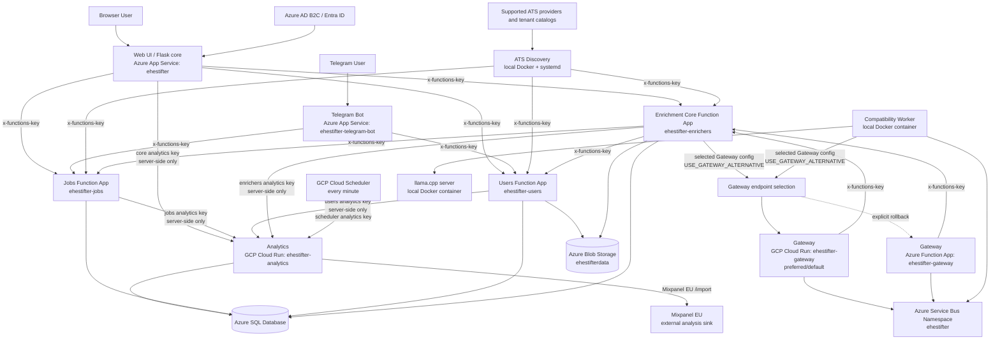

# Ehestifter System Design

Status: current `as-is` system design; ATS Discovery integrated after Phase 9 (2026-07-26)
Audience: coding agents working on the repo, with enough detail for a human operator to follow
Primary goal: enable safe feature work without guessing, duplicating existing services, or bypassing ownership boundaries

---

## 1. Purpose and usage model

This document is the master design reference for the Ehestifter system as it exists today.

It is intentionally written for AI-assisted development:
- to help an agent find the correct component to modify,
- to make existing services and APIs visible before the agent invents replacements,
- to document ownership boundaries and invariants,
- to reduce accidental cross-domain DB changes,
- to encode operational constraints that are easy to miss from code alone.

This document describes the system **as implemented now**. It is not a wishlist. Near-term planned behavior should normally live in a separate milestone document during implementation, then be merged back into this file when the milestone is complete.

### 1.1 How agents should use this document

For frontier models with large context, this file can be used directly.

For smaller-context or local models, do **not** feed the full file blindly into every task. Use this process instead:

1. Identify the feature or defect area.
2. Extract only the relevant sections from this document.
3. Add only the code files directly involved.
4. Ask for clarification before any hazardous DB or cross-domain write change.

Recommended extraction targets:
- UI work: sections on Web UI, Jobs API used by UI, auth/trust boundaries, operational constraints.
- Telegram work: Telegram bot, Users telegram-link endpoints, Jobs telegram endpoints.
- Enrichment work: Enrichment Core, Gateway, Compatibility worker, Jobs projection contract, Users CV snapshot contract.
- DB-affecting work: domain ownership, canonical data model, invariants, API contracts, and relevant migration SQL.

### 1.2 Documentation strategy

Current preferred documentation shape:
- one master system document for the whole platform,
- temporary milestone design docs for ongoing medium-sized changes,
- merge milestone docs into this file once the milestone is implemented and stabilized.

This keeps chat-based workflows simple while still allowing iteration during longer implementation arcs.

---

## 2. System overview

Ehestifter is an applicant's application tracking system built to experiment with Azure services and agentic AI workflows on a hobby budget.

Current implemented system areas:
- web UI for users,
- Users domain,
- Jobs domain,
- Telegram bot,
- enrichment subsystem for compatibility scoring,
- ATS Discovery for scheduled multi-user vacancy discovery from supported ATS providers,
- Gateway running on GCP Cloud Run as the preferred worker/enrichment Gateway path, with Azure Functions Gateway retained as explicit rollback,
- Analytics bounded context running on GCP Cloud Run with owned Azure SQL event storage and Mixpanel EU export,
- local inference stack for compatibility worker.

### 2.1 High-level goals

Current practical goals:
- keep a shared store of job postings,
- discover recent relevant postings from supported ATS providers without scanning each tenant once per user,
- allow each user to track their own status against a shared job,
- allow each user to maintain a CV and bounded discovery preferences,
- compute compatibility scores for `(jobId, userId)`,
- expose those scores in UX without recomputing on every page load,
- record selected product behavior events in owned storage and export them to Mixpanel for lightweight analysis,
- keep the system cheap and simple enough to operate without managed enterprise tooling.

### 2.2 High-level component map


```mermaid
flowchart TD
    User[Browser User] --> Core[Web UI / Flask core
Azure App Service: ehestifter]
    TGUser[Telegram User] --> Bot[Telegram Bot
Azure App Service: ehestifter-telegram-bot]
    ATSSources[Supported ATS providers and tenant catalogs] --> ATS[ATS Discovery
local Docker + systemd]

    Core -->|x-functions-key| Jobs[Jobs Function App
ehestifter-jobs]
    Core -->|x-functions-key| Users[Users Function App
ehestifter-users]
    Core -->|x-functions-key| Enrichers[Enrichment Core Function App
ehestifter-enrichers]

    Bot -->|x-functions-key| Jobs
    Bot -->|x-functions-key| Users

    ATS -->|x-functions-key| Jobs
    ATS -->|x-functions-key| Users
    ATS -->|x-functions-key| Enrichers

    Enrichers -->|x-functions-key| Jobs
    Enrichers -->|x-functions-key| Users

    Core -->|core analytics key
server-side only| Analytics[Analytics
GCP Cloud Run: ehestifter-analytics]
    Jobs -->|jobs analytics key
server-side only| Analytics
    Users -->|users analytics key
server-side only| Analytics
    Enrichers -->|enrichers analytics key
server-side only| Analytics
    Scheduler[GCP Cloud Scheduler
every minute] -->|scheduler analytics key| Analytics

    Analytics --> SQL[(Azure SQL Database)]
    Analytics -->|Mixpanel EU /import| Mixpanel[Mixpanel EU
external analysis sink]

    Enrichers -->|selected Gateway config
USE_GATEWAY_ALTERNATIVE| GatewaySelector[Gateway endpoint selection]
    Worker[Compatibility Worker
local Docker container] -->|selected Gateway config
USE_GATEWAY_ALTERNATIVE| GatewaySelector

    GatewaySelector --> GcpGateway[Gateway
GCP Cloud Run: ehestifter-gateway
preferred/default]
    GatewaySelector -. explicit rollback .-> AzureGateway[Gateway
Azure Function App: ehestifter-gateway]

    GcpGateway --> SB[Azure Service Bus Namespace
ehestifter]
    AzureGateway --> SB
    Worker --> Llama[llama.cpp server
local Docker container]
    Worker --> SB

    GcpGateway -->|x-functions-key| Enrichers
    AzureGateway -->|x-functions-key| Enrichers

    Jobs --> SQL
    Users --> SQL
    Enrichers --> SQL
    Users --> Blob[(Azure Blob Storage
ehestifterdata)]
    Enrichers --> Blob

    Auth[Azure AD B2C / Entra ID] --> Core
```

### 2.3 Component inventory and deployment topology

| Component | Purpose | Hosting |
|---|---|---|
| `backend/core` | Web UI, proxy endpoints, presentation layer | Azure App Service `ehestifter` |
| `backend/telegrambot` | Telegram UX and command handling | Azure App Service `ehestifter-telegram-bot` |
| `backend/jobs` | Jobs domain API and job-related storage ownership | Azure Function App `ehestifter-jobs` |
| `backend/users` | Users domain API and user-related storage ownership | Azure Function App `ehestifter-users` |
| `backend/enrichers` | Enrichment Core, run lifecycle, snapshot building, projection dispatch | Azure Function App `ehestifter-enrichers` |
| `backend/gateway` | Worker-facing APIs and Service Bus bridge | GCP Cloud Run service `ehestifter-gateway` is preferred/default; Azure Function App `ehestifter-gateway` remains deployed as explicit rollback |
| `backend/analytics` | Owned analytics ingestion, event storage, Mixpanel mapping/dispatch, diagnostics | GCP Cloud Run service `ehestifter-analytics` |
| `scrapers/ats-discovery` | ATS catalogs, provider scanning, multi-user matching, Jobs import orchestration, local scheduler | Local Docker container launched manually or by system-level systemd timers |
| `workers/compatibility` | Polls work, builds prompts, performs compatibility inference | Local Docker container `compatibility-worker` |
| `infrastructure/docker/llama.cpp` | Local inference server | Local Docker container `llama-server` |
| Azure Service Bus | Queue transport for enrichment requests | Azure namespace `ehestifter` |
| Azure SQL | Main relational storage | Azure SQL server `eperidbserver` |
| Azure Blob Storage | CV and enrichment snapshot blob storage | Storage account `ehestifterdata` |
| GCP Cloud Scheduler | Periodic trigger for Analytics Mixpanel dispatch | GCP job `ehestifter-analytics-dispatch` in `europe-west3` |
| Mixpanel EU | External analytics exploration UI and export sink | Mixpanel EU Data Residency project; server-side `/import` only |
| Azure AD B2C / Entra ID | Browser auth | Azure-managed |
| GitHub Actions | CI/CD for Azure-hosted services and GCP Gateway Cloud Run deployment | GitHub-hosted; GCP deployment uses Workload Identity Federation |

### 2.4 Environment model

The system is effectively single-environment, even though the Gateway now has both Azure and GCP hosting options.

Constraints:
- one shared hobby environment,
- one main Azure resource group in one subscription,
- one GCP project used for the current preferred Gateway runtime and Analytics Cloud Run service,
- one local development node used for compatibility inference and ATS Discovery; it may be powered off at a scheduled slot,
- no realistic support for multiple full environments on current budget/free tiers.

Implication for agents:
- changes should be incremental,
- migrations and config changes should be conservative,
- avoid large refactors that assume a staging environment exists,
- do not mistake Azure Gateway and GCP Gateway for staging/production environments; they are explicit runtime alternatives for the same single system,
- Analytics is part of the same single system even though it runs on GCP Cloud Run and writes to Azure SQL,
- ATS Discovery scheduling must tolerate the local node being offline by processing the latest due logical slot after boot/resume rather than replaying every missed day.

---

## 3. Architecture principles and non-goals

### 3.1 Principles

1. **Domain ownership is real.** Each domain owns its own tables and write model.
2. **Use APIs across domains.** Do not directly update another domain's tables.
3. **Keep it simple.** Avoid introducing new frameworks or infrastructure unless they materially simplify the service.
4. **Preserve operability without advanced AI providers.** The owner should be able to operate and improve the system even without frontier hosted inference.
5. **Assume cold starts.** Retries, timeouts, and UI blocking/unblocking patterns are part of the architecture, not incidental implementation detail.
6. **Prefer consistency of shape over novelty.** New functions and routes should resemble existing ones.
7. **Select Gateway explicitly.** Gateway routing between Azure and GCP is controlled by environment variables; there is no automatic fallback or dual-dispatch.
8. **Bound external discovery traffic.** ATS scans use explicit provider budgets, pacing, lookback overlap, health partitions, canaries, and import caps; broad unbounded scraping is not acceptable.

### 3.2 Non-goals

These are not current goals and agents should not optimize for them unless explicitly asked:
- multi-environment Azure or multi-cloud environment architecture,
- enterprise-grade IAM inside every function endpoint,
- event-sourced redesign of domains,
- rich frontend SPA framework migration,
- direct browser access to domain functions,
- cloud-scale or unbounded ATS scraping, automatic application submission, or replacing manual application status,
- warehouse-style analytics, Synapse, Parquet archival, or broad BI platform work,
- browser-side Mixpanel SDK/session replay/clickstream tracking,
- replacing Azure Service Bus with GCP Pub/Sub as part of the current Gateway hosting setup.

---

## 4. Authentication, identity, and trust boundaries

### 4.1 Browser authentication

Browser users authenticate through Azure AD B2C / Entra ID.

The authenticated session is stored in Flask session cookie state in `backend/core`. There is no persistent session storage for this. On app restart, the session must be re-established.

### 4.2 Internal service authentication

Internal service-to-service calls use the `x-functions-key` header.

This is the practical trust boundary in the current system:
- domain function apps do not perform their own user-facing auth validation inside endpoints,
- access is controlled by being behind function/web app surfaces that require platform-level credentials,
- web users should not call Jobs/Users/Enrichers/Gateway directly.

For GCP Cloud Run Gateway:
- Cloud Run hosting does not provide Azure Functions platform-managed function-key validation,
- the Flask/Cloud Run wrapper emulates the existing service-level auth shape by checking `x-functions-key`,
- protected worker/Gateway routes must reject missing or invalid keys before invoking shared handlers,
- public reachability at Cloud Run level is acceptable only because protected routes enforce the same application-level key check.

For GCP Cloud Run Analytics:
- Cloud Run hosting does not provide Azure Functions platform-managed function-key validation,
- the Analytics Flask/Cloud Run app checks `x-functions-key` in application code before protected route behavior,
- each producer has a distinct Analytics key and source-domain binding,
- Core, Jobs, Users, and Enrichers keys can ingest events only for their own `sourceDomain`,
- Scheduler and operator keys are separate from producer keys,
- browser JavaScript must never receive Analytics keys, Mixpanel credentials, or Mixpanel project tokens.

ATS Discovery is trusted local infrastructure. It calls protected Users, Jobs, and Enrichment endpoints with service credentials supplied through existing local secret/config paths. It must not log those credentials, CV content, provider session cookies, CSRF tokens, or full user profiles. Provider endpoints are external and untrusted; responses are bounded, validated, and normalized before product-domain calls.

### 4.3 Canonical user identity

Canonical internal user identity is carried as `X-User-Id`.

The web UI extracts it from session, then sends it to downstream domains. Jobs and Users treat that user ID as the caller identity.

Important implication:
- if a feature needs user identity in Jobs or Users, it should usually arrive via `X-User-Id` through the existing proxy/orchestration path rather than by inventing a new identity system,
- analytics events use the canonical internal `userId` only inside owned Analytics SQL storage; Mixpanel receives a stable pseudonymous `distinct_id` instead of the raw internal user ID.

### 4.4 Telegram identity

Telegram users are linked to Ehestifter users through Users-domain link code flow.

After link:
- telegram account is resolved to internal user by bot logic via Users domain,
- bot then calls Jobs and Users APIs with function key auth,
- no separate per-request auth is performed inside Jobs or Users for Telegram-originated calls.

### 4.5 Worker and inference trust model

Compatibility worker and llama.cpp do not expose user-reachable public interfaces.

Current assumptions:
- compatibility worker is trusted local infrastructure,
- llama.cpp is deployed in a relatively safe environment and currently unauthenticated,
- worker accesses the selected Gateway and Service Bus, not domain DBs,
- worker uses explicit Gateway configuration to choose Azure Gateway or GCP Gateway; it must not perform automatic fallback.

---

## 5. Bounded contexts and ownership

This section is the most important guardrail for future work.

### 5.1 Web UI (`backend/core`)

Owns:
- HTML templates,
- CSS and browser JS used by the web UI,
- presentation logic,
- proxy/orchestration routes under `backend/core/routes/ui_*`,
- retry and timeout handling at the UI interaction level,
- client-visible state transitions such as disabled buttons and intermediate placeholders.

Does not own:
- Jobs data,
- Users data,
- Enrichment run data,
- domain business rules unless there is a very strong reason.

Rules:
- do not add domain storage into core,
- do not let the browser call function apps directly,
- keep core mostly stateless except session and presentation concerns.

### 5.2 Users domain (`backend/users`)

Owns:
- initial creation of internal user from Azure AD B2C data,
- retrieval of user basic information,
- user preferences related to the user profile,
- bounded discovery eligibility/profile output derived from saved user preferences,
- Telegram link code generation and link/unlink flows,
- storage references to user-specific blobs,
- CV storage and retrieval contracts for enrichment.

Current user-related data in scope:
- basic info: name, email, role,
- preferences: CV in Quill Delta format and plaintext,
- telegram link code,
- linked telegram account ID,
- blob paths and metadata for current CV version.

Design intent:
- user-specific information belongs here unless another domain is obviously better suited.

### 5.3 Jobs domain (`backend/jobs`)

Owns:
- job offering records,
- job history records,
- user-job statuses,
- job locations,
- compatibility score projections shown in job UX,
- filters and shaping of job data for a specific user.

Current scope rule:
- anything concerning a job offering or a relation of a job to a user belongs here unless another domain is clearly better suited.

Important modeling choice:
- jobs are shared across users,
- statuses and projections are per `(jobId, userId)`.

### 5.4 Enrichment Core (`backend/enrichers`)

Owns:
- enrichment run lifecycle,
- building self-contained run input snapshots,
- storing enrichment run state and history,
- triggering projection dispatch after terminal runs,
- rescheduling or cleanup tasks related to enrichment.

Does not own:
- how Jobs stores compatibility projections,
- Jobs read models,
- Users CV source of truth,
- worker compute logic.

Boundary:
- Enrichment Core pushes projections to Jobs and stops there.
- It does not care how Jobs persists or exposes them beyond the API contract.

### 5.5 Gateway (`backend/gateway`)

Owns:
- Service Bus integration,
- worker-facing HTTPS APIs,
- worker lease issuance and completion forwarding,
- queue bridging for enrichment work,
- provider-neutral Gateway route behavior shared by hosting wrappers.

Current hosting shape:
- GCP Cloud Run service `ehestifter-gateway` is the preferred/default Gateway endpoint,
- Azure Function App `ehestifter-gateway` remains deployed and usable as explicit rollback,
- Azure Functions wrapper and Flask/Gunicorn Cloud Run wrapper should stay thin,
- route behavior should live in shared provider-neutral handlers and existing helpers where practical.

Does not own:
- enrichment run semantics,
- job or user data,
- downstream projection logic,
- automatic routing or fallback decisions between Azure and GCP.

### 5.6 Compatibility worker (`workers/compatibility`)

Owns:
- polling for work,
- extracting worker input payload,
- building prompt from job snapshot and CV text,
- calling llama.cpp,
- normalizing result into score and summary,
- returning result to Gateway.

Does not own:
- direct SQL access,
- direct Jobs or Users API usage,
- projection storage,
- enrichment run lifecycle decisions,
- Gateway fallback or duplicate-dispatch behavior.

### 5.7 Telegram bot (`backend/telegrambot`)

Owns:
- Telegram chat UX,
- command parsing,
- callback handling for bot navigation and disambiguation,
- bot-side convenience/session state only.

Does not own:
- durable user/job business data,
- alternate write models,
- persistent records beyond chat/session metadata.

### 5.8 Analytics (`backend/analytics`)

Owns:
- analytics ingestion API,
- canonical owned analytics event log,
- vendor-specific Mixpanel dispatch/outbox state,
- pseudonymous `distinct_id` generation for Mixpanel export,
- Mixpanel `/import` payload mapping,
- retry/dead/sent delivery state for Mixpanel export,
- small diagnostics for dispatch health.

Does not own:
- Jobs, Users, or Enrichment business data,
- product-domain decisions or write models,
- Mixpanel dashboards as source of truth,
- browser-side tracking,
- Telegram analytics in v1,
- Synapse, Parquet, or warehouse archival.

Boundaries:
- product services emit selected event facts to Analytics using server-side HTTP and producer-specific keys,
- Analytics validates event names, source domains, source surfaces, schema version, and forbidden property names before persistence,
- Analytics stores the raw internal `UserId` only in owned Azure SQL and exports only the pseudonymous `DistinctId` to Mixpanel,
- Mixpanel is an external analysis sink, not a durable system of record.

### 5.9 ATS Discovery (`scrapers/ats-discovery`)

Owns:
- provider adapters and normalized candidate observations;
- machine-managed catalogs and operator discovery policy;
- target planning, provider/variant health, cadence, canaries, and bounded request policy;
- cheap matching of one shared scan against all eligible users;
- Jobs canonical-identity preflight, detail enrichment orchestration, location normalization, and guarded import;
- compatibility request orchestration for matched users;
- local run artifacts, provider/tenant state, scheduler state, locking, backups, and retention.

Does not own:
- canonical job identity or job persistence;
- user/CV source data;
- compatibility run/projection lifecycle;
- application status;
- direct SQL writes in any product domain.

Boundary:
- Users supplies bounded discovery profiles without CV text;
- Jobs remains authoritative for duplicate identity and shared job creation;
- Enrichment Core receives compatibility requests per matched user;
- a discovery import never creates or changes user status.

---

## 6. Canonical domain model

This is a light schema reference for agents. It is intentionally not a full DB spec.

### 6.1 Users domain model

#### User entity and related state

Users domain stores:
- user identity derived from Azure AD B2C,
- name,
- email,
- role,
- current CV metadata,
- telegram link state.

#### CV storage model

Current CV representation:
- Quill Delta format,
- normalized plaintext,
- both stored as blobs,
- blob paths stored in DB with metadata.

Invariants:
- one active CV version per user,
- plaintext CV is regenerated from Quill Delta on update,
- enrichment consumes plaintext, not Quill Delta.

#### Telegram link model

Stores:
- optional one-time or current link code,
- linked telegram account ID.

Invariants:
- telegram link `(userId <-> telegram account)` is unique,
- link code is unique when present,
- a user may have no current link code,
- one system user may be linked to only one Azure AD B2C object.

### 6.2 Jobs domain model

#### `dbo.JobOfferings`

Main table for job records.

Purpose:
- canonical shared record of a job offering.

Identity model:
- each job has a canonical provider identity made from:
  - `Provider`
  - `ProviderTenant`
  - `ExternalId`

Current DB rule:
- unique filtered index on `(Provider, ProviderTenant, ExternalId)` where `IsDeleted = 0`.

This index is currently:
- `UX_JobOfferings_ProviderTenantExternalId`.

Required identity fields:
- `Provider` `NOT NULL`
- `ProviderTenant` `NOT NULL` with default `''`
- `ExternalId` `NOT NULL`

Creation behavior:
- API attempts to infer these via `backend/jobs/helpers/url_helpers.py` using best effort from URL,
- defaults are used where possible,
- if required identity fields still cannot be filled, create returns `400`.

Implication for agents:
- do not treat provider identity as optional,
- do not bypass the existing inference/defaulting path when creating jobs.

#### `dbo.JobOfferingHistory`

Purpose:
- append-only-ish history of job changes.

Current behavior:
- entry added on create,
- entry added on update,
- entry added on delete by marking `is_deleted`,
- entry added on status update,
- enrichment runs are not currently journaled here.

Note:
- history visibility is filtered so one user does not see irrelevant status entries for another user.

#### `dbo.UserJobStatus`

Purpose:
- stores per-user status progression for jobs.

Current behavior:
- a new row is added on each status change,
- Jobs domain derives current status from latest relevant entry.

Modeling implication:
- status is not a single mutable field on the job; it is a per-user timeline.

#### `dbo.JobOfferingLocations`

Purpose:
- stores zero-to-many location rows for a job.

Reason:
- job location may be undefined, one city, multiple cities in one country, or multiple cities in multiple countries.

Presentation behavior:
- domain concatenates/combines these before returning user-facing DTOs.

#### `dbo.CompatibilityScores`

Purpose:
- stores compatibility projections owned by Jobs domain.

Current behavior:
- owned by Jobs domain,
- written through internal projection upsert endpoint,
- rewritten if an entry already exists for `(jobId, userId)`, inserted otherwise,
- no versioning.

Important boundary:
- Enrichment Core only produces projection intent and delivery;
- Jobs decides storage and exposure.

### 6.3 Enrichment domain model

#### Enrichment runs

Enrichment run is the lifecycle object for one enrichment attempt for one subject.

Current subject identity:
- `subjectKey = "{jobId}:{userId}"`

Current implemented enricher:
- compatibility score.

#### Projection dispatch

Enrichment Core is responsible for dispatching projection results to owning domains after successful completion.

Current implemented projection target:
- Jobs compatibility score projection only.

### 6.4 Analytics domain model

#### `dbo.AnalyticsEvents`

Purpose:
- canonical owned analytics event log.

Important fields:
- `EventId` — canonical event ID and Mixpanel `$insert_id`,
- `OccurredAtUtc` and `ReceivedAtUtc`,
- `SourceDomain` — currently `core`, `jobs`, `users`, or `enrichers`,
- `SourceSurface` — currently `web`, `worker`, `timer`, or `system`,
- `UserId` — internal user ID retained in owned SQL only,
- `DistinctId` — stable pseudonymous Mixpanel identity,
- `EventName`, `SubjectType`, `SubjectId`, `CorrelationId`, `ProducerEventId`, `SchemaVersion`,
- `PropertiesJson` — sanitized event properties.

Current idempotency behavior:
- when producers provide `ProducerEventId`, Analytics enforces uniqueness for `(SourceDomain, ProducerEventId)`,
- Mixpanel export uses the canonical `EventId` as `$insert_id`.

#### `dbo.AnalyticsDispatch`

Purpose:
- vendor-specific delivery/outbox state for Analytics events.

Current sink:
- `mixpanel`.

Important fields:
- `DispatchId`, `EventId`, `Sink`, `Status`,
- `AttemptCount`, `NextAttemptAtUtc`, `LastAttemptAtUtc`, `SentAtUtc`,
- `LastErrorCode`, `LastErrorJson`.

Current statuses:
- `pending`, `sending`, `sent`, `retry`, `dead`.

Operational behavior:
- GCP Cloud Scheduler calls a protected dispatch endpoint every minute,
- the dispatcher maps pending events to Mixpanel EU `/import` payloads,
- successful exports are marked `sent`, retryable failures become `retry`, permanent validation/mapping failures become `dead`.

#### Analytics event taxonomy

Current v1 event names:
- `Job Creation Started`,
- `Job Duplicate Checked`,
- `Job List Viewed`,
- `Job Detail Viewed`,
- `Job Search Performed`,
- `Job Created`,
- `Job Creation Failed`,
- `Job Updated`,
- `Job Deleted`,
- `Job Status Changed`,
- `CV Updated`,
- `Compatibility Requested`,
- `Compatibility Completed`,
- `Compatibility Failed`.

Agent rules:
- do not add new analytics event names without updating the Analytics allowlist and this design document,
- do not send raw URLs, provider external IDs, job titles/names, company names, descriptions, CV text, CV length, emails, display names, Telegram identifiers, tokens, keys, cookies, stack traces, exception text, or compatibility summaries,
- prefer safe enum-like properties and stable IDs over free text.

---

## 7. Terminology normalization

The codebase and conversations have some terminology drift. Agents should normalize to the following meanings.

### 7.1 Job / job offering / job application

In the current system, these are often used as near-synonyms.

Operationally:
- the stored object is a shared job posting,
- it can be interacted with by multiple users,
- each user can have independent status and compatibility projection against the same job.

When implementing features, prefer these distinctions:
- **job offering**: the shared job record,
- **user status**: that user’s current progression against the job,
- **compatibility projection**: enrichment result for that `(jobId, userId)`.

### 7.2 Status terminology

A status is per-user and describes where that user is in their process for a shared job.

A final status means that user is considered finished with the job, but the job may still be active for other users.

### 7.3 Projection terminology

A projection is a downstream domain materialization of an enrichment result.

Current example:
- compatibility score shown by Jobs domain in job lists and details.

---

## 8. Canonical invariants

Agents should preserve these unless explicitly asked to change the model.

### 8.1 Users domain invariants

- One active CV version per user.
- CV plaintext is regenerated from Quill Delta on update.
- Telegram link is unique.
- Telegram link code is unique when present.
- Azure AD B2C is the source of user identity.
- One system user maps to one Azure AD B2C object.

### 8.2 Jobs domain invariants

- Jobs are shared across users.
- Status is per `(jobId, userId)` and derived from latest status entry.
- Compatibility score is per `(jobId, userId)`.
- Provider identity fields are mandatory for canonical job identity.
- Duplicate create should resolve to existing active job rather than creating another copy.
- Delete is logical delete, not physical disappearance from history.

### 8.3 Enrichment invariants

- Enrichment input snapshot must be self-contained.
- Worker must not fetch Jobs or Users data directly.
- Enrichment Core does not care how Jobs stores projections.
- Gateway and worker must not become owners of domain data.
- Gateway selection must be explicit; no automatic fallback between Azure Gateway and GCP Gateway.

### 8.4 Cross-system invariants

- User-facing requests must be proxied through web core rather than calling domain functions directly.
- Cross-domain writes should happen via owner domain APIs, not shared DB writes.
- Static service-level configuration belongs in environment variables, not DB rows.
- Analytics is a side channel for selected behavior facts; product correctness must not depend on Analytics ingestion or Mixpanel export succeeding.
- Browser code must not call Analytics or Mixpanel directly.

### 8.5 ATS Discovery invariants

- ATS tenants are scanned once per shared target plan, not once per user.
- Catalogs and operator policy remain separate inputs.
- Disabled operator overrides always win; runtime health cannot re-enable them.
- Materially different provider protocols have independent health partitions.
- Provider canaries are health-only and never call Jobs or enter import candidates.
- Jobs API canonical identity is authoritative for deduplication and creation.
- Detail fetching and shared job creation happen once per candidate, not once per matched user.
- Compatibility is requested only for matched users; status is never created automatically.
- New discovery imports use `foundOn = "ats-discovery"`; historical provenance is not rewritten.
- Direct Compose commands bypass the host scheduler lock and are not the preferred routine operator path.

---

## 9. Users domain details

### 9.1 Responsibilities

Users domain currently owns:
- user bootstrap from Azure AD B2C,
- returning user basic profile information,
- Telegram link code generation and display,
- Telegram link and unlink,
- user preferences, currently primarily CV plus discovery filters,
- bounded discovery-eligible profile output for ATS Discovery,
- user-related blob management for CV storage,
- internal plaintext CV snapshot retrieval for enrichment,
- emitting the safe `CV Updated` analytics event after successful web CV/preferences update.

### 9.2 Storage split

Stored in SQL:
- user metadata,
- role,
- blob paths,
- telegram link metadata,
- CV version metadata.

Stored in Blob Storage:
- CV Quill Delta blob,
- CV plaintext blob.

### 9.3 Internal enrichment contract: CV snapshot

Users internal endpoint:
- `GET /users/internal/{userId}/cv-snapshot`

Current payload shape:

```json
{
  "UserId": "GUID",
  "CVVersionId": "GUID",
  "LastUpdated": "2026-03-18T12:34:56+00:00",
  "CVTextBlobPath": "path/to/blob.txt",
  "CVPlainText": "normalized plain text CV"
}
```

Important details:
- this endpoint returns plaintext CV plus metadata,
- enrichment uses `CVPlainText`,
- blob path is included mainly as a debugging breadcrumb,
- Quill Delta is **not** the enrichment input contract.

Agent rule:
- do not move CV-to-plaintext conversion into Enrichment Core or worker,
- do not make the worker depend on Quill/Delta parsing.

### 9.4 Users endpoints with known consumers

| Endpoint | Purpose | Main consumers |
|---|---|---|
| `GET /users/me` | create-or-return internal user from Azure auth context and return basic info | web core |
| `GET /users/link-code` | generate/show Telegram link code | web core |
| `POST /users/link-telegram` | link Telegram account to internal user | telegram bot |
| `POST /users/unlink-telegram` | unlink Telegram account | telegram bot |
| `GET /users/by-telegram/{telegram_user_id}` | resolve Telegram account to internal user | telegram bot |
| `POST /users/preferences` | update user preferences including CV | web core |
| `GET /users/internal/{userId}/cv-snapshot` | provide plaintext CV snapshot for enrichment | Enrichment Core |
| `GET /users/internal/discovery-eligible` | return bounded discovery-eligible profiles and saved filters without CV text | ATS Discovery |

---

## 10. Jobs domain details

### 10.1 Responsibilities

Jobs domain owns:
- shared job offering records,
- deduplication on create,
- status progression per user,
- job history,
- location storage and presentation,
- compatibility score storage and exposure,
- user-specific shaping of job lists and details,
- emitting safe web-originated Jobs analytics events after successful owner-domain writes.

### 10.2 Create/update/delete lifecycle

Current lifecycle:
1. Job is created manually by user.
2. On create, deduplication is attempted using canonical provider identity.
3. If duplicate exists, existing job ID is returned instead of creating a new job.
4. Optional updates may modify non-identifying data such as description/title/company-related fields.
5. Only the creating user may update that job.
6. User may set status multiple times over time until a final status is reached for that user.
7. Final status does not prevent status updates for that user, used in UI for lists filtration. 
8. Author may delete a job, mainly for cleanup/correction.
9. Archival is planned for the future but not yet implemented.

### 10.3 Deduplication model

Canonical job identity is based on:
- `Provider`
- `ProviderTenant`
- `ExternalId`

Create-path behavior:
- `deduce_from_url(url)` in `backend/jobs/helpers/url_helpers.py` attempts to infer:
  - `foundOn`
  - `provider`
  - `providerTenant`
  - `externalId`
- defaults such as `corporate-site` are used where appropriate,
- request is rejected with `400` if required canonical identity still cannot be resolved.

User-facing duplicate detection:
- `GET/HEAD /jobs/exists` is used during job creation to warn about duplicates,
- user may continue anyway,
- final create still resolves to existing job instead of creating a duplicate,
- history entry may still be written for the create attempt.

### 10.4 Status model

Canonical status options are defined in:
- `backend/jobs/helpers/status_normalize.py` as `STATUS_OPTIONS`

Current statuses:
- `Applied`
- `Screening Booked`
- `Screening Done`
- `HM interview Booked`
- `HM interview Done`
- `More interviews Booked`
- `More interviews Done`
- `Rejected with Filled`
- `Rejected with Unfortunately`
- `Withdrew Applications`
- `Got Offer`
- `Accepted Offer`
- `Turned down Offer`
- `Ignored`

Final statuses are defined in:
- `backend/jobs/helpers/domain_constants.py` as `FINAL_STATUSES`

Current final statuses:
- `Rejected with Filled`
- `Rejected with Unfortunately`
- `Accepted Offer`
- `Turned down Offer`
- `Withdrew Applications`
- `Ignored`

Agent rules:
- do not invent new statuses casually,
- do not hardcode alternate status spellings in new features,
- read the canonical constants before touching status logic.

### 10.5 Compatibility projection model

Compatibility projection is:
- owned by Jobs domain,
- stored in `dbo.CompatibilityScores`,
- keyed by `(jobId, userId)` in practical effect,
- overwritten on new accepted upsert,
- not versioned.

This is intentionally separate from status.

A user may have:
- no status but a compatibility score,
- a status but no compatibility score,
- both,
- final status while another user still actively uses the same job.

### 10.6 Jobs endpoints with known consumers

#### Used by Enrichment Core

| Endpoint | Purpose |
|---|---|
| `GET /internal/jobs/{jobId:guid}/snapshot` | get job snapshot for enrichment input |
| `POST /internal/jobs/compatibility-projections:bulk-upsert` | upsert compatibility projections |

#### Used by Telegram bot

| Endpoint | Purpose |
|---|---|
| `POST /jobs/apply-by-url` | create job from link and set status |
| `GET /jobs/with-statuses` | list/search jobs with statuses for bot workflows |
| `GET /jobs` | also used by `myjobs` flow |

#### Used by web UI

| Endpoint | Purpose |
|---|---|
| `POST /jobs` | create job |
| `GET/HEAD /jobs/exists` | duplicate warning on create |
| `GET /jobs` | list jobs with category/filter/search/pagination |
| `PUT /jobs/{id}` | update editable job fields |
| `DELETE /jobs/{id}` | logical delete |
| `GET /jobs/{id:guid}` | detailed job view |
| `PUT /jobs/{jobId}/status` | update current user status |
| `GET /jobs/{jobId}/history` | get job history relevant to current user |
| `POST /jobs/compatibility` | get compatibility scores for list rendering |
| `POST /jobs/status` | get statuses for list rendering |
| `GET /jobs/reports/status` | CSV report of user statuses |
| `POST /jobs/{jobId}/history` | mostly test helper / possible future enrichment journaling hook |

### 10.7 Internal enrichment contract: job snapshot

Jobs internal endpoint:
- `GET /internal/jobs/{jobId:guid}/snapshot`

Current enrichment consumer usage expects fields at least equivalent to:
- `jobId`
- `jobName`
- `jobDescription`
- `companyName`

Enrichment Core currently uses:
- `jobName` as snapshot title,
- `jobDescription` as snapshot description,
- `companyName` as debugging breadcrumb metadata.

Agent rule:
- maintain backward compatibility for these fields unless enrichment flow is deliberately updated in the same change.

---

## 11. Web UI (`backend/core`) details

### 11.1 Role in the system

Web core is presentation and orchestration, not a domain owner.

It exists to:
- authenticate browser users through Azure AD B2C,
- proxy user actions to function apps using `x-functions-key`,
- shape data for HTML templates,
- provide JS/CSS behavior for a usable browser experience under cold-start constraints.

### 11.2 Important pages/templates

Current implemented user-visible pages:
- `index.html` — job list entry point,
- `job.html` — job details,
- `job_new.html` — job create,
- `job_edit.html` — job edit,
- `me.html` — user profile / about me / CV management,
- `display.html` — debug page; not a core user flow.

Important template composition:
- `index.html` also uses:
  - `backend/core/templates/jobs/_index_geo.html`
  - `backend/core/templates/jobs/_index_logic.html`
  - `backend/core/templates/jobs/_index_styles.html`
- create/edit uses:
  - `backend/core/templates/jobs/_job_form.html`

### 11.3 Job list behavior

`index.html` is the main interaction surface.

Current characteristics:
- three tabs/categories,
- filters,
- search,
- pagination,
- partial redraw behavior rather than full page refresh for many interactions.

### 11.4 Details page behavior

`job.html` includes notable enrichment-related UX:
- enricher widget,
- modal/history inspection flow,
- history of enrichments accessible via inspect flow.

### 11.5 UI interaction model under cold starts

This is an architectural rule, not just UX polish.

Current expected pattern:
- disable clicked button and other relevant controls,
- show intermediate values/loading placeholders,
- only unblock controls when server response confirms next action is safe,
- redraw changed data from server response (e.g. set job status to what is corresponding endpoint returned),
- allow non-mutating page interaction like scrolling while waiting.

Reason:
- Azure Functions on free tier cold-start often causes long waits,
- retry and timeout behavior exists throughout the stack,
- duplicate clicks must be avoided,
- UI is not the source of truth and should rely on states from domains instead of creating parallel data twins

Agent rule:
- preserve this blocking/unblocking model when adding new mutating interactions.

### 11.6 Proxy rule

Browser traffic that interacts with domain data should go through core proxy routes under `backend/core/routes/ui_*`.

Do not expose direct browser calls to function apps just because it looks simpler.

### 11.7 Web Core analytics producer role

Web Core emits route-level analytics events server-side for selected web UX facts:
- `Job Creation Started`,
- `Job Duplicate Checked`,
- `Job List Viewed`,
- `Job Detail Viewed`,
- `Job Search Performed`.

Web Core also marks downstream domain calls with `X-Source-Surface: web` where producer domains need to distinguish web-originated events from Telegram, system, or worker-originated calls.

Rules:
- do not send analytics events from browser JavaScript,
- do not expose Analytics or Mixpanel credentials to browser code,
- do not send raw search terms, raw job URLs, provider external IDs, job titles/names, company names, or descriptions,
- use best-effort server-side emission with short timeout.

Known tradeoff:
- current producer emission is synchronous inside request handling and can add up to the configured short timeout to the route that emits the event,
- this is accepted for now because implementation is small and product action still wins if Analytics fails,
- if UX is affected, replace or supplement this with asynchronous local emission, for example an in-process/background queue or a local durable cache/outbox that drains to Analytics later.

---

## 12. Telegram bot details

### 12.1 Current purpose

Telegram bot is currently a lightweight convenience interface, not the primary product surface.

Practical goals today:
- quickly create/apply to job from URL,
- update status without opening web UI,
- inspect active jobs list for status operations,
- link and unlink Telegram account to Ehestifter account.

### 12.2 Important user flows

Implemented/expected bot flows:
- `/applied <link>` or equivalent create-from-link convenience,
- `/status <Status> <Job name or company search>` convenience update,
- `myjobs` active applications list,
- link/unlink account flows.

### 12.3 Bot-specific endpoints

Users endpoints introduced specifically for Telegram:
- `GET /users/by-telegram/{telegram_user_id}`
- `POST /users/link-telegram`
- `POST /users/unlink-telegram`

Jobs endpoints introduced or used specifically for Telegram:
- `POST /jobs/apply-by-url`
- `GET /jobs/with-statuses`
- `GET /jobs` for `myjobs`

### 12.4 Bot state ownership

Bot owns only transient chat/session convenience state.

Do not move durable product state into the bot.

### 12.5 Important callback behavior

Current callback-sensitive flows worth preserving:
- list pagination,
- user picking the right job for `/status` when multiple jobs match,
- error handling around those flows.

---

## 13. Enrichment subsystem

This section supersedes the previously separate enrichment design doc and merges the finished milestone into the master design.

### 13.1 Purpose

Current enrichment subsystem computes compatibility score for `(jobId, userId)` and publishes a projection into Jobs domain so Jobs can expose it efficiently.

It also emits safe enrichment lifecycle analytics events for web-triggered compatibility runs:
- `Compatibility Requested`,
- `Compatibility Completed`,
- `Compatibility Failed`.

### 13.2 Bounded contexts inside enrichment

#### Enrichment Core (`backend/enrichers`)

Owns:
- run lifecycle,
- snapshot creation,
- run status/history,
- projection dispatch creation,
- cleanup and timer-driven operations.

Does not:
- talk directly to Service Bus as the worker transport owner,
- call local inference,
- read/write Jobs or Users tables directly.

#### Gateway (`backend/gateway`)

Owns:
- Service Bus bridge,
- worker lease and completion APIs,
- queue dispatch path,
- shared provider-neutral route behavior used by both Azure Functions and Cloud Run wrappers.

Current deployment:
- preferred/default runtime: GCP Cloud Run service `ehestifter-gateway`,
- rollback runtime: Azure Function App `ehestifter-gateway`,
- both runtimes use the same route behavior where practical.

#### Compatibility worker (`workers/compatibility`)

Owns:
- compute path only.

### 13.3 Snapshot composition

When creating a run, Enrichment Core currently:
1. calls Jobs internal snapshot endpoint,
2. calls Users internal CV snapshot endpoint,
3. builds a self-contained snapshot,
4. stores that snapshot in blob,
5. requests Gateway dispatch.

Current code-level composition logic uses:
- `job_snap.get("jobName")` as title,
- `job_snap.get("jobDescription")` as description,
- `cv_snap.get("CVPlainText")` as CV text.

Current snapshot shape:

```json
{
  "runId": "GUID",
  "enricherType": "compatibility.v1",
  "subjectKey": "jobId:userId",
  "jobOfferingId": "GUID",
  "userId": "GUID",
  "job": {
    "title": "...",
    "description": "..."
  },
  "cv": {
    "text": "..."
  },
  "meta": {
    "source": "core",
    "version": 1,
    "jobSnapshot": {
      "jobId": "GUID",
      "companyName": "..."
    },
    "cvSnapshot": {
      "CVVersionId": "GUID",
      "LastUpdated": "...",
      "CVTextBlobPath": "..."
    }
  }
}
```

Agent rules:
- Gateway passes this payload through unmodified as worker input,
- worker prompt building currently depends on `input.job` and `input.cv.text`,
- do not break this schema casually.

### 13.4 Worker input handling

Compatibility worker currently extracts:
- `lease.get("input")`
- `input.job`
- `input.cv.text`

Then builds prompt using something equivalent to:
- `build_prompt(job=job, cv_text=cv_text)`

This is the intended contract.

### 13.5 Worker output contract

Compatibility worker normalizes final result into:

```json
{
  "score": 0.0,
  "summary": "text"
}
```

Current semantics:
- `score` is numeric in range `0.0` to `10.0`,
- `summary` is free text,
- summary may include optional inline diagnostics formatting such as `[diagnostics] ...` when relevant.

This is the practical normalized result contract between worker and the rest of the system.

### 13.6 Projection application to Jobs

Enrichment Core posts compatibility results to Jobs internal endpoint:
- `POST /internal/jobs/compatibility-projections:bulk-upsert`

Current ownership split:
- Enrichment Core owns when and what to send,
- Jobs owns how projection is stored and exposed.

Current storage behavior in Jobs:
- `dbo.CompatibilityScores`
- insert if missing for `(jobId, userId)`
- overwrite if existing
- no versioning.

### 13.7 Scheduled/background behavior

Currently relevant scheduled/background processes:
- `dispatch_projections` in Enrichment Core,
- `cleanup_runs` in Enrichment Core,
- message consumption in compatibility worker.

Analytics note:
- normal worker/Gateway completion can emit `Compatibility Completed` or `Compatibility Failed`,
- cleanup timer expiry currently is not the primary analytics emission path and should not be assumed to produce per-run analytics events unless deliberately extended.

No other scheduled system jobs should be assumed.

### 13.8 Gateway hosting and dispatch selection

Gateway is currently hosted in two places:

| Runtime | Role |
|---|---|
| GCP Cloud Run service `ehestifter-gateway` | Preferred/default Gateway endpoint |
| Azure Function App `ehestifter-gateway` | Explicit rollback endpoint |

The GCP Cloud Run Gateway was selected because Gateway has a narrow boundary:
- worker-facing HTTP APIs,
- Service Bus dispatch bridge,
- worker lease and completion forwarding,
- no ownership of Jobs, Users, or Enrichment domain data.

Gateway route behavior should remain shared between hosting wrappers:

```text
Azure Functions wrapper
  -> provider-neutral handlers
  -> existing helpers

Flask / Cloud Run wrapper
  -> provider-neutral handlers
  -> existing helpers
```

GCP Cloud Run Gateway emulates the Azure Functions `x-functions-key` auth shape in the Flask/Cloud Run wrapper before invoking shared handlers.

Enrichers Core and compatibility worker both select the Gateway explicitly through environment variables. There is no automatic fallback.

Reason:
- dispatch operations can be ambiguous,
- a timeout may mean the Service Bus message was enqueued but the HTTP response was lost,
- retrying through a second Gateway could create duplicate dispatch messages and confusing diagnostics.

Worker Gateway configuration shape:

```env
# Gateway - primary, normally Azure Function App
GATEWAY_BASE_URL="https://YOUR-GATEWAY.azurewebsites.net"
GATEWAY_API_KEY="YOUR_AZURE_GATEWAY_KEY"

# Gateway - alternative, currently GCP Cloud Run Gateway.
# This is currently the preferred/default production Gateway path.
# Keep USE_GATEWAY_ALTERNATIVE=1 unless deliberately rolling back to Azure Gateway.
USE_GATEWAY_ALTERNATIVE="1"
GATEWAY_ALTERNATIVE_BASE_URL="https://YOUR-GCP-GATEWAY.run.app"
GATEWAY_ALTERNATIVE_API_KEY="YOUR_GCP_GATEWAY_KEY"
```

Enrichers Core Gateway dispatch configuration shape:

```env
# Gateway - primary, normally Azure Function App
GATEWAY_API_BASE_URL="https://YOUR-AZURE-GATEWAY.azurewebsites.net"
GATEWAY_FUNCTION_KEY="YOUR_AZURE_GATEWAY_KEY"

# Gateway - alternative, currently GCP Cloud Run Gateway.
# This is currently the preferred/default production Gateway path.
# Keep USE_GATEWAY_ALTERNATIVE=1 unless deliberately rolling back to Azure Gateway.
USE_GATEWAY_ALTERNATIVE="1"
GATEWAY_ALTERNATIVE_API_BASE_URL="https://YOUR-GCP-GATEWAY.run.app"
GATEWAY_ALTERNATIVE_FUNCTION_KEY="YOUR_GCP_GATEWAY_KEY"
```

Behavior:

```text
USE_GATEWAY_ALTERNATIVE=0 -> use Azure Gateway
USE_GATEWAY_ALTERNATIVE=1 -> use GCP Cloud Run Gateway
```

Rules:
- select exactly one Gateway URL/key pair,
- no automatic fallback,
- no dual dispatch,
- log selected Gateway base URL at dispatch time,
- never log function keys,
- keep Azure Gateway available as rollback.

### 13.9 GCP Gateway runtime configuration

Current GCP deployment identity:

```text
project: ehestifter-gcp
region: europe-west3
service: ehestifter-gateway
artifact registry image path: europe-west3-docker.pkg.dev/ehestifter-gcp/ehestifter/ehestifter-gateway:<tag>
```

The exact current URL, image tag, and revision should be inspected from GCP rather than hardcoded into this document:

```bash
gcloud run services describe "$SERVICE_NAME" \
  --project "$PROJECT_ID" \
  --region "$REGION" \
  --format='yaml(
    status.url,
    status.latestReadyRevisionName,
    status.latestCreatedRevisionName,
    status.traffic,
    spec.template.spec.containers[0].image,
    spec.template.spec.serviceAccountName
  )'
```

Runtime configuration expected on Cloud Run:

```text
EHESTIFTER_ENRICHERS_BASE_URL=https://ehestifter-enrichers.azurewebsites.net/api
GATEWAY_SB_QUEUE_NAME=enrichment-requests
GATEWAY_FUNCTION_KEY=<Secret Manager: gateway-gcp-function-key>
EHESTIFTER_ENRICHERS_FUNCTION_KEY=<Secret Manager: gateway-gcp-enrichers-function-key>
GATEWAY_SB_CONNECTION_STRING=<Secret Manager: gateway-gcp-sb-connection-string>
```

Important runtime findings:
- `EHESTIFTER_ENRICHERS_BASE_URL` must include `/api`,
- Gateway code expects `GATEWAY_SB_CONNECTION_STRING`, not `SB_CONNECTION_STRING`,
- Gateway code expects `GATEWAY_SB_QUEUE_NAME`, not `SB_QUEUE_NAME`,
- `GATEWAY_FUNCTION_KEY` is used by the Flask/Cloud Run wrapper to emulate Azure-style function-key auth,
- Cloud Run uses a dedicated runtime service account.

Operational posture:
- Cloud Run uses conservative hobby-budget settings,
- current intended shape is `min instances: 0`, `max instances: 2`, `concurrency: 8`, `timeout: 120s`,
- verify actual values in Cloud Run before relying on them during operations.

### 13.10 Gateway deployment automation

GCP Gateway deployment is automated from GitHub Actions.

Current intended deployment flow:

```text
push/workflow_dispatch in GitHub
  -> GitHub Actions
  -> authenticate to GCP through Workload Identity Federation
  -> build Gateway container
  -> push image to Artifact Registry
  -> deploy image to Cloud Run service ehestifter-gateway
  -> smoke test /ping
```

Design rules:
- do not store long-lived GCP service account JSON keys in GitHub,
- use GitHub OIDC + GCP Workload Identity Federation,
- deploy with a dedicated GCP deployer service account,
- allow the deployer to act as the dedicated Cloud Run runtime service account when required,
- tag images with the GitHub commit SHA,
- keep runtime secrets and environment variables in GCP Cloud Run / Secret Manager rather than duplicating them into GitHub Actions.

Recommended workflow triggers:
- `workflow_dispatch` for manual deploy/redeploy,
- `push` to main with path filter for `backend/gateway/**` once automation is trusted.

GCP-side validation after deploy:
- latest created revision equals latest ready revision,
- 100% traffic points to the intended revision,
- deployed image tag equals GitHub commit SHA,
- Cloud Run service account is the dedicated runtime service account,
- runtime environment variables and Secret Manager references remain present,
- Artifact Registry contains the SHA-tagged image,
- Cloud Run logs show `/ping` returning `pong`,
- audit logs show the GitHub deployer service account as deploy principal.

### 13.11 Gateway diagnostics

Gateway upstream logging for Enrichers Core calls should include enough context to diagnose bad upstream configuration without exposing secrets.

When Enrichers Core does not cooperate, Gateway should log:
- method,
- path,
- configured Enrichers Core base URL,
- upstream status code,
- response body snippet,
- transport-level exception type when applicable.

This was added because an incorrect `EHESTIFTER_ENRICHERS_BASE_URL` can otherwise surface to the worker as an unhelpful `404 Not found`, without making a missing `/api` suffix obvious.

Service Bus dispatch logging should continue to include useful start/success/failure diagnostics.

### 13.12 Gateway known quirks

`/healthz` is not currently treated as a blocking validation endpoint.

Validated Gateway endpoints are:

```text
GET  /ping
POST /work/lease
POST /gateway/dispatch
```

`/ping` and protected Gateway routes are sufficient operational smoke tests for now. `/healthz` can be fixed or removed later.

---

## 14. ATS Discovery

### 14.1 Purpose and runtime

ATS Discovery is the implemented vacancy-discovery component at:

```text
scrapers/ats-discovery
```

It is a local Docker, run-to-completion workload. A small host-side Python scheduler and system-level systemd timers provide daily discovery and independent catalog refresh. Optional GCP Cloud Run Job deployment was explicitly skipped; local operation remains the steady-state runtime.

The product/service identity is `ats-discovery`. Career-Ops is an attributed upstream source for selected provider code and design ideas, not the Ehestifter component name.

### 14.2 Supported provider surface

Accepted provider paths:
- Greenhouse;
- Lever;
- Ashby;
- Workday;
- Personio;
- SmartRecruiters;
- Softgarden;
- SuccessFactors RMK;
- SuccessFactors CSB.

Machine-managed catalogs exist for Ashby, Greenhouse, Lever, and Workday. Catalog artifacts record source, license, fetch time, item count, and SHA-256 and are atomically replaced only after validation. Operator priority, disabled, and provider-patch policy remains separate from machine-managed catalogs.

SuccessFactors uses independent operational partitions:

```text
successfactors:rmk
successfactors:csb
```

Circuit breakers, cooldowns, state, summaries, and canaries use the health partition where a provider family contains materially different protocols. Tenant-local durable failures do not automatically degrade the entire partition.

### 14.3 Planning, cadence, and provider safety

The target planner combines:
- tracked/priority company policy;
- disabled overrides;
- provider catalogs and provider-specific patches;
- provider budgets under a global hard ceiling;
- tenant runtime state;
- provider/variant cooldowns and circuit breakers;
- due health canaries;
- bounded lookback and overlap;
- compounded eligible-user filters.

Priority targets and due provider canaries are processed before normal catalog shards. Healthy catalogs rotate deterministically so a large provider catalog cannot starve smaller providers. Recently relevant tenants can be promoted; long-empty tenants are demoted; suspected/confirmed-dead tenants receive long-interval re-probes.

Provider-supported date constraints are used where useful. Otherwise posting age is filtered locally. Request pacing, concurrency, pagination, detail limits, rate observations, and live catalog target caps remain explicit configuration; autonomous rate tuning is not implemented.

Provider canaries are filter-independent health probes. They never call Jobs and never become import candidates. High-risk protocols distinguish explicit empty, suspicious empty/volume collapse, schema/authentication failure, transport failure, and healthy nonempty outcomes.

### 14.4 Multi-user discovery contract

Users exposes:

```text
GET /users/internal/discovery-eligible
```

The endpoint returns a bounded set of eligible users and saved discovery filters. CV text does not cross this boundary. Malformed saved filters fail closed. A user with no saved filters follows the scanner's deliberately configured default matching behavior.

One scan plan compounds all eligible profiles. Each candidate records the users that pass cheap filters. A candidate matching nobody is rejected before Jobs detail/import and compatibility work.

For a retained candidate:
1. Jobs canonical-identity preflight occurs once;
2. detail is fetched once when the candidate is missing and detail is required;
3. the shared job is created once through Jobs;
4. compatibility is requested through Enrichment Core for each matched user when required;
5. no application status is created or changed.

### 14.5 Jobs and Enrichment integration

Jobs remains authoritative for canonical identity and persistence:

```text
GET /jobs/exists?url=<origin-url>
POST /jobs
```

ATS Discovery preserves provider-native identity and acquisition evidence even when Jobs resolves a different canonical representation. New imported jobs use:

```text
foundOn = "ats-discovery"
```

`foundOn` is the creation channel, not a complete observation history. Historical jobs and run artifacts created under the former product name remain unchanged as evidence.

Before creating a Jobs record, ATS Discovery canonicalizes provider locations
against a committed snapshot generated from Web Core's geography dictionary and
re-evaluates geographic eligibility after bounded detail enrichment. Provider
location observations remain primary; explicit description statements can
refine them, add independently supported scope, or mark a conflict, but do not
silently overwrite them. Only decisive incompatible restrictions or mandatory
presence outside the compatible scope block creation. Unresolved parsing and
inconclusive conflicts fail open and remain visible in location artifacts.

The geography snapshot is a scanner build input, not a runtime cross-domain
filesystem dependency. `tools/refresh_ats_geo_snapshot.py` is the host entry
point and runs the Node generator inside the scanner Docker image from a full
checkout. Scanner-only deployments consume the committed snapshot.

Compatibility requests go through the existing Enrichment Core API. ATS Discovery never writes compatibility projections or enrichment tables directly.

### 14.6 State, artifacts, and observability

Scanner-owned local state is under `scrapers/ats-discovery/data`:

```text
data/catalogs/                 machine-managed provider catalogs
data/runs/<run-id>/            run evidence
data/state/tenant-state.json   provider/tenant cadence and health
data/state/scheduler-state.json logical scheduler slots and outcomes
data/backups/                  bounded operational backups
```

Representative run artifacts include target plans, provider and canary results, candidates/rejections, user matches, Jobs preflight, detail/location/import results, tenant-state changes, rate observations, summary, and scheduler metadata.

Artifacts and logs must not contain service keys, provider cookies/CSRF tokens, CV content, or full user profiles. Operator visibility comes from run summaries, provider/variant warnings, canary outcomes, `ats-ops status`, systemd unit state, and journal output.

### 14.7 Scheduling and missed-run semantics

Phase 7 supplies independent system-level timers for daily discovery and weekly catalog refresh. Services run as the repository owner so Docker bind-mount ownership matches manual operation.

The timer's `Persistent=true` activation is not treated as proof of completed work. The scheduler calculates a local logical slot and records it complete only after scanner exit `0`, scanner exit `2` (completed degraded), or an intentional minimum-spacing collapse.

Rules:
- only the latest due slot is processed; missed days are not replayed one by one;
- a late boot follows the same catch-up logic with no late cutoff;
- only the remaining configured boot grace is waited;
- `fcntl.flock` serializes discovery, catalog refresh, and wrapped manual scanner commands;
- lock contention and launch failures use bounded retry behavior;
- malformed or timezone-mismatched state fails closed;
- discovery can continue with the previous valid catalogs when refresh fails;
- scheduler and tenant-state backups plus artifact retention are bounded.

Rendered systemd units contain the scanner path, Compose service, timer times, and retry values. Changing the scanner path or schedule/retry configuration requires uninstalling/reinstalling the units.

Direct `docker compose run` remains possible for controlled validation but bypasses the host lock. Routine manual operation should use:

```text
./ops/scheduler/ats-ops scanner -- <scanner arguments>
```

### 14.8 Attribution and maintenance

Selected provider implementations are derived from pinned Career-Ops sources under their recorded license. Selected catalogs and resilience ideas are attributed to job-board-aggregator under the recorded license/non-commercial constraint.

`scripts/copy-upstream-providers.sh` is bootstrap/reproducibility tooling only. It may overwrite adapted provider files and must not be used as an unattended update path. Upstream improvements are inspected, selectively ported, attributed, and validated through fixtures and live canaries where appropriate.

### 14.9 Known limitations

- Direct Compose commands cannot be forced to take the host lock.
- There is no external email/chat alert channel; failure visibility is local.
- Timers catch up after resume but do not wake sleeping hardware.
- Rootless Docker needs explicit operator adaptation.
- Scheduler timing/retry changes require unit reinstall.
- Unsupported provider ingestion and missing tenant catalogs remain deferred issues.
- The local node can delay discovery until its next boot/resume; latest-slot catch-up avoids waiting a full additional day but cannot discover while powered off.

---

## 15. Main end-to-end flows

### 15.1 Browser user opens the system

1. User authenticates through Azure AD B2C.
2. Flask core establishes session state.
3. Core resolves/uses internal user identity and proxies downstream requests using function key auth.

### 15.2 Manual job creation from web UI

1. User opens create page.
2. User enters job URL and fills other fields. 
3. UI infers provider identity from URL.
4. UI may call `GET/HEAD /jobs/exists` to warn about likely duplicate based on provider identity.
5. User submits create.
6. Jobs domain attempts provider identity inference/defaulting if not present.
7. If canonical identity maps to existing non-deleted job, existing job is returned.
8. UI redirects to resulting job details page.
9. History entry may be written even when duplicate create resolves to existing object.

### 15.3 Job update from web UI

1. User opens edit page.
2. Only non-identifying fields are editable.
3. Submit goes through core proxy.
4. Jobs validates ownership and updates allowed fields.
5. Jobs writes history entry.

### 15.4 Status update from web UI

1. User selects new status for a job.
2. Core proxy sends to `PUT /jobs/{jobId}/status`.
3. Jobs appends new status entry in `UserJobStatus`.
4. Current visible status for that user is derived from latest entry.
5. History relevant to that user can later show the change.

### 15.5 Telegram link flow

1. Web UI gets or displays link code using Users domain.
2. User performs bot link operation.
3. Telegram bot calls `POST /users/link-telegram`.
4. Users stores unique mapping between telegram account and internal user.
5. Future bot operations resolve internal user via `GET /users/by-telegram/{telegram_user_id}`.

### 15.6 Telegram status update flow

1. User sends status command with a status and search text.
2. Bot resolves internal user.
3. Bot searches user jobs/statuses.
4. If ambiguous, callback flow lets user pick correct job.
5. Bot calls Jobs endpoint to update status.

### 15.7 Enrichment run flow

1. A compatibility run is requested.
2. Enrichment Core creates run and fetches job + CV snapshots.
3. Enrichment Core emits `Compatibility Requested` for web-originated compatibility runs.
4. Enrichment Core writes self-contained snapshot blob.
5. Enrichment Core asks the selected Gateway to dispatch the run. Current default is GCP Cloud Run Gateway when `USE_GATEWAY_ALTERNATIVE=1`.
6. Gateway enqueues work in Service Bus.
7. Compatibility worker consumes message, leases work through Gateway, receives input payload.
8. Worker builds prompt and calls local llama.cpp.
9. Worker normalizes result into `score` and `summary`.
10. Worker sends completion to the selected Gateway. Current default is GCP Cloud Run Gateway when `USE_GATEWAY_ALTERNATIVE=1`.
11. Gateway forwards completion to Enrichment Core.
12. Enrichment Core stores terminal result.
13. Enrichment Core emits `Compatibility Completed` or `Compatibility Failed` for actual new terminal completions.
14. Enrichment Core dispatches compatibility projection to Jobs.
15. Jobs upserts into `dbo.CompatibilityScores`.
16. Web UI later reads compatibility via Jobs APIs, not by calling Enrichment Core directly for list rendering.

### 15.8 Analytics ingestion and Mixpanel export flow

1. A product action or route succeeds in Core, Jobs, Users, or Enrichment Core.
2. The producer emits a small server-side Analytics event with its own Analytics key.
3. Analytics validates the key, source domain, source surface, event name, schema version, and property safety.
4. Analytics stores the canonical event in `dbo.AnalyticsEvents` and creates a pending Mixpanel dispatch row in `dbo.AnalyticsDispatch`.
5. GCP Cloud Scheduler calls `POST /analytics/dispatch/run` every minute with the scheduler Analytics key.
6. Analytics maps due dispatch rows to Mixpanel EU `/import` payloads.
7. Mixpanel receives stable event names, pseudonymous `distinct_id`, deterministic `$insert_id`, and sanitized properties.
8. Dispatch rows become `sent`, `retry`, or `dead`.

Producer behavior:
- product success/failure is based on owner-domain behavior, not Analytics behavior,
- Analytics emit helpers use short timeouts and do not raise errors into product routes,
- synchronous event emission is a known tradeoff and may be replaced with async/local-cache-first emission if UX latency becomes visible.

### 15.9 Analytics event sources

Current implemented server-side event sources:

| Source domain | Events |
|---|---|
| `core` | `Job Creation Started`, `Job Duplicate Checked`, `Job List Viewed`, `Job Detail Viewed`, `Job Search Performed` |
| `jobs` | `Job Created`, `Job Creation Failed`, `Job Updated`, `Job Deleted`, `Job Status Changed` |
| `users` | `CV Updated` |
| `enrichers` | `Compatibility Requested`, `Compatibility Completed`, `Compatibility Failed` |

Telegram analytics is intentionally deferred.

### 15.10 Scheduled ATS discovery flow

1. The systemd timer activates the discovery oneshot service for the latest due local slot.
2. The host scheduler waits only the remaining boot grace and obtains the global `flock`.
3. ATS Discovery loads valid catalogs, operator policy, tenant/provider health, and bounded eligible-user profiles.
4. The planner orders due canaries/priority targets and deterministic provider catalog shards.
5. Each selected ATS target is fetched once and normalized.
6. Cheap filters produce a matched-user set; candidates matching no user are rejected.
7. Jobs canonical identity is checked once per retained candidate.
8. Missing candidates receive bounded detail/location processing and guarded shared-job creation.
9. Compatibility is requested for matched users without creating status.
10. Run artifacts, tenant state, rate observations, and scheduler metadata are published.
11. Exit `0` records normal completion; exit `2` records degraded completion; other outcomes remain due and visible for bounded retry/operator action.

---

## 16. API contract guidance

This is not full OpenAPI. It is the minimal cross-service contract map agents should honor.

### 16.1 General rules

- UI endpoints in core face the browser.
- Domain functions are not intended for direct browser access.
- Internal/domain-to-domain auth is function-key based.

### 16.2 Idempotency guidance

Current project-wide intent:
- non-create operations should be repeatable,
- create should resolve duplicates to existing object where applicable,
- projection upserts should be safe to repeat.

### 16.3 Hazard rule for DB-affecting changes

Any non-trivial DB write-path change should be treated as hazardous.

Agent protocol for hazardous DB work:
1. identify owning domain,
2. inspect existing migrations and SQL shape,
3. avoid touching tables not owned by that service,
4. ask for explicit clarification or approval if change is ambiguous or cross-domain,
5. prefer adding/using owner-domain endpoint over direct cross-domain table access.

### 16.4 ATS Discovery cross-domain contracts

Users discovery input:
- `GET /users/internal/discovery-eligible`
- function-key protected;
- bounded profile/filter output;
- no CV text.

Jobs identity and persistence:
- `GET /jobs/exists?url=<origin-url>` is authoritative for canonical identity preflight;
- `POST /jobs` creates/reconciles the shared job;
- imports carry system-actor context and `foundOn = "ats-discovery"`;
- no status endpoint is called by discovery.

Enrichment:
- compatibility requests use the existing Enrichment Core service contract;
- discovery does not write run or projection tables directly.

Catalog/provider traffic is not a product-domain API contract. Provider-specific schemas remain isolated behind adapters and normalized candidate observations.

### 16.5 Analytics API contract

Ingest endpoint:
- `POST /analytics/events`

Dispatch endpoint:
- `POST /analytics/dispatch/run`

Diagnostics endpoint:
- `GET /analytics/dispatch/status`

Auth:
- `x-functions-key` is required for protected Analytics routes,
- each producer key is bound to exactly one allowed `sourceDomain`,
- scheduler/operator keys are separate from producer keys.

Ingest request shape:

```json
{
  "eventName": "Job Status Changed",
  "occurredAtUtc": "2026-07-06T10:15:30.123Z",
  "sourceDomain": "jobs",
  "sourceSurface": "web",
  "userId": "GUID-or-null",
  "subjectType": "job",
  "subjectId": "GUID-or-null",
  "correlationId": "optional-guid-or-request-id",
  "properties": {
    "job_id": "GUID",
    "new_status": "Applied",
    "is_final_status": false
  },
  "schemaVersion": 1,
  "producerEventId": "optional-source-idempotency-key"
}
```

Rules:
- event names must be allowlisted unless local/test config explicitly allows unknown events,
- `schemaVersion` is currently `1`,
- `properties` must be a JSON object,
- forbidden property names are rejected recursively,
- `occurredAtUtc` must include timezone information and is stored as UTC,
- raw internal `UserId` is not exported to Mixpanel.

---

## 17. Storage model

### 17.1 Azure SQL

Current SQL usage:
- Users domain tables and metadata,
- Jobs domain tables,
- Enrichment run/projection dispatch tables,
- Analytics event and dispatch tables.

Guideline:
- DB stores domain data,
- DB should not become storage for static service configuration.

### 17.2 Blob Storage

Current blob usage is intentionally narrow.

Used for:
- user CV blobs in Quill Delta and plaintext,
- enrichment run input snapshots.

Not currently used for:
- broad archival of jobs,
- Parquet analytics,
- general product file storage beyond CV/enrichment needs.

### 17.3 ATS Discovery local storage

ATS Discovery stores operational data under `scrapers/ats-discovery/data`:
- machine-managed provider catalogs;
- immutable-ish run artifacts;
- tenant/provider health and cadence state;
- scheduler logical-slot state;
- bounded state backups.

These are scanner-owned files, not product-domain records. Catalog/state replacement is atomic where implemented. Historical run artifacts are retained as evidence and are not rewritten during product renames. Active scheduler state corruption fails closed rather than silently resetting and risking duplicate work.

### 17.4 Analytics storage and external export

Current live Analytics storage:
- `dbo.AnalyticsEvents` is the canonical owned analytics event log,
- `dbo.AnalyticsDispatch` is the vendor-specific dispatch/outbox table for Mixpanel export.

Runtime SQL identity:
- Analytics uses a dedicated restricted SQL runtime user,
- the runtime user should have only `SELECT`, `INSERT`, and `UPDATE` on Analytics tables,
- the runtime user should not be able to read or mutate Jobs, Users, or Enrichment domain tables,
- no broad `db_datareader` or `db_datawriter` role should be used for the Analytics runtime user.

External export:
- Mixpanel EU is an analysis sink reached through server-side `/import`,
- Mixpanel is not the source of truth,
- Analytics export can be disabled without disabling owned SQL collection.

Not currently active:
- Synapse analytics stack,
- Parquet archival pipeline,
- data warehouse / BI pipeline beyond the owned SQL event log and Mixpanel export.

Agent rule:
- do not assume Synapse or Parquet archival exists,
- do not bypass Analytics validation by writing analytics rows directly from producer services.

---

## 18. Configuration and secrets

### 18.1 General rule

Environment variables are the normal place for service-level configuration and secrets.

Current convention is imperfect and somewhat inconsistent across services. Agents should improve consistency gradually, not by large rewrites.

### 18.2 Rules for future changes

- avoid introducing new env vars without a good reason,
- avoid duplicating existing env vars under new names,
- do not move static service settings into DB rows,
- prefer matching existing config style within a service,
- preserve explicit Gateway switch semantics,
- do not introduce automatic fallback between Azure Gateway and GCP Gateway.

### 18.3 Operational location

For Azure-hosted apps/functions, environment values are typically managed in:
- `Settings -> Environment variables`

For local worker and llama.cpp:
- local config files / docker compose / env files as already used by that component.

For GCP Cloud Run Gateway:
- runtime environment variables are managed on the Cloud Run service,
- secrets are stored in GCP Secret Manager and referenced by Cloud Run,
- GitHub Actions deploys images only and should not recreate or duplicate runtime secrets.

For GCP Cloud Run Analytics:
- runtime environment variables are managed on the Cloud Run service,
- secrets are stored in GCP Secret Manager and referenced by Cloud Run,
- GCP Cloud Scheduler calls the protected dispatch endpoint with the scheduler-specific Analytics key,
- do not print Scheduler HTTP headers in CLI output because they include `x-functions-key`.

For local ATS Discovery:
- committed examples and operator-owned local JSON/YAML files configure providers, tracked companies, overrides, discovery policy, scanner behavior, and scheduler behavior;
- machine-managed catalogs and local state live under `data/`;
- service credentials live in the existing local secret/config path and are not committed;
- `config/scheduler.local.json` is authoritative for logical slots while systemd sees rendered values, so schedule/retry changes require reinstall;
- Compose service identity is `ats-discovery`.

Core/Jobs/Users/Enrichers Analytics producer config:

```env
ANALYTICS_COLLECTION_ENABLED="1"
ANALYTICS_BASE_URL="https://ehestifter-analytics-...run.app"
ANALYTICS_FUNCTION_KEY="<service-specific analytics key>"
ANALYTICS_EMIT_TIMEOUT_SECONDS="2"
```

Central Analytics config includes:

```env
ANALYTICS_COLLECTION_ENABLED="1"
ANALYTICS_MIXPANEL_EXPORT_ENABLED="1"
MIXPANEL_API_BASE_URL="https://api-eu.mixpanel.com"
MIXPANEL_STRICT="1"
MIXPANEL_BATCH_SIZE="500"
MIXPANEL_MAX_ATTEMPTS="8"
```

Disable switches:
- producer-side `ANALYTICS_COLLECTION_ENABLED=0` stops that producer from attempting Analytics calls,
- central `ANALYTICS_COLLECTION_ENABLED=0` stops accepting/storing new Analytics events,
- central `ANALYTICS_MIXPANEL_EXPORT_ENABLED=0` stops outbound Mixpanel export while keeping owned collection active.

---

## 19. Operational constraints and observability

### 19.1 Cold starts and retries

Cold starts are a first-order design constraint.

Current reality:
- Azure Functions on free tier hibernate,
- requests may be slow after idle periods,
- timeouts and retries are expected throughout the stack,
- UI must guard against duplicate actions during waits.

Agent rules:
- preserve retry behavior unless replacing it with something clearly better,
- preserve user-safe button blocking for mutating actions,
- do not optimize only for warm-path performance.

### 19.2 Database latency assumptions

DB currently does not hibernate the way Functions do, but existing DB retries/timeouts should still be preserved in case of future tier changes or transient failures.

### 19.3 Observability

Current observability tools:
- Azure Application Insights,
- Azure platform logs to limited practical effect,
- GCP Cloud Run logs for GCP Gateway runtime behavior,
- GCP Cloud Run logs for Analytics runtime and dispatch behavior,
- Analytics `/analytics/dispatch/status` diagnostics,
- Mixpanel Events view for inspecting exported event payloads,
- GCP Cloud Scheduler status for Analytics dispatch trigger,
- GCP Artifact Registry image tags for Gateway and Analytics deployment traceability,
- GitHub Actions run logs for GCP Gateway deployment automation,
- ATS Discovery `summary.json`, provider/variant warnings, canary outcomes, target/state/rate artifacts, and scheduler metadata,
- `ats-ops status`, systemd unit state, and journal output for local discovery scheduling,
- job history as partial end-to-end breadcrumbing.

Known limitations:
- Azure logs often include provider/platform noise and may miss the most useful error-stream detail,
- Gateway diagnosis may require checking both Cloud Run logs and Enrichers Core logs because Gateway forwards work to Enrichers Core and Service Bus,
- Analytics producer emission is synchronous and best-effort; it can still add up to the configured short timeout to a product request when Analytics is slow.

### 19.4 Runbooks

ATS Discovery has a component runbook in `scrapers/ats-discovery/README.md`, including config validation, wrapper-based manual operation, timer installation/uninstallation, missed-slot semantics, tests, and artifact inspection.

Still future work:
- retrying failed enrichment dispatches;
- inspecting stuck enrichment runs;
- clearing broken message states;
- diagnosing projection-delivery failures;
- formalizing GCP Gateway deploy/rollback checks;
- deciding whether Analytics producer emission should move to async/local-cache-first if UX is affected;
- adding Analytics retention/cleanup once event volume is understood;
- setting GCP budget alerts;
- adding an external ATS Discovery notification channel if local unit/artifact visibility becomes insufficient.

---

## 20. Current exclusions and explicitly not implemented

These items should not be treated as working system capabilities:
- optional GCP Cloud Run Job execution for ATS Discovery;
- unsupported ATS ingestion such as BambooHR, iCIMS, Paylocity, or StepStone;
- tenant catalogs for providers not represented by current machine-managed catalogs;
- automatic job application or automatic application-status creation;
- Synapse analytics stack,
- Parquet archival pipeline,
- broad data warehouse / BI pipeline beyond owned Analytics SQL and Mixpanel export,
- browser-side Mixpanel SDK or direct browser-to-Analytics tracking,
- Telegram analytics,
- automated archival of old jobs,
- additional enrichers beyond compatibility score,
- automatic Gateway failover,
- GCP Pub/Sub replacement for Azure Service Bus,
- custom domain for GCP Gateway or Analytics.

Agent rule:
- do not build on stubs as though they are operational without explicit instruction.

---

## 21. Strict design rules for future changes

These rules are intentionally blunt.

### 21.1 Do

- Use the owner domain API for another domain's data.
- Keep new function structure close to existing patterns.
- Preserve current trust boundaries.
- Preserve explicit Gateway selection and no-fallback behavior.
- Preserve cold-start-safe UI interaction patterns.
- Keep Analytics best-effort and privacy-preserving.
- Reuse existing constants and helpers before creating new ones.
- Read migration SQL before touching DB-side behavior.
- Preserve provider/variant health isolation, request bounds, canaries, and import caps in ATS Discovery.
- Use Jobs preflight/create and Enrichment APIs rather than adding cross-domain scanner writes.
- Ask for clarification when a DB write change is ambiguous.

### 21.2 Do not

- Do not directly mutate DB tables owned by another domain.
- Do not let browser code call domain functions directly.
- Do not introduce React or another heavy frontend framework unless explicitly justified.
- Do not introduce new dependencies just because they are modern or convenient.
- Do not store static service config in DB.
- Do not duplicate existing services because they were hard to find.
- Do not move business logic into web core unless putting it into the owner domain would be significantly worse.
- Do not assume unfinished experiments are production features.
- Do not add automatic fallback between Azure Gateway and GCP Gateway.
- Do not log function keys or duplicate GCP runtime secrets into GitHub Actions.
- Do not put Mixpanel credentials, Analytics keys, raw user IDs, CV text, job descriptions, job titles, company names, raw URLs, external IDs, exception text, or tokens into Mixpanel events.
- Do not scan ATS tenants once per user, bypass Jobs canonical identity, create status from discovery, or turn provider canaries into import sources.
- Do not remove upstream attribution when renaming or adapting ATS Discovery code.

---

## 22. Feature development protocol for coding agents

This section is intended to shape future agent behavior.

### 22.1 Before proposing code changes

An agent should first answer:
1. Which domain owns this behavior?
2. Is the change UI-only, domain-only, enrichment-only, or cross-domain?
3. Which existing endpoints/helpers/constants already cover part of it?
4. Does the change affect DB writes, auth, or cross-domain contracts?

### 22.2 Extraction-first workflow

For small-context models, use this process:
1. Extract the smallest relevant set of sections from this document.
2. Add only the directly relevant code files.
3. Summarize the extracted constraints before implementing.
4. Only then modify code.

### 22.3 Required caution for hazardous changes

Treat these as hazardous and deserving explicit clarification or highly conservative implementation:
- adding/removing/changing DB columns,
- changing ownership of data between domains,
- changing endpoint contracts consumed by another service,
- changing canonical status values,
- changing enrichment snapshot schema,
- changing proxy/auth routing,
- changing deduplication identity.

### 22.4 Preferred implementation style

- Extend existing route/module shapes instead of creating parallel patterns.
- Prefer narrow targeted changes.
- Keep code understandable without requiring advanced inference tooling.
- Add comments where intent is not obvious from code.

### 22.5 When to create a milestone design doc

Create a temporary milestone doc when:
- the change spans multiple services,
- the feature is expected to take several iterations/days,
- the intended architecture is not fully represented by current code,
- rollout order matters.

Merge the milestone doc back into this master file after implementation stabilizes.

---

## 23. Safe extension guidance

### 23.1 Adding a new user-facing browser feature

Usually touch, in order:
1. owner domain endpoint or logic,
2. core proxy route,
3. template and JS/CSS in core,
4. retries/blocking states,
5. tests.

### 23.2 Adding a new Telegram flow

Usually touch:
1. bot command/callback handling,
2. existing Jobs/Users endpoints if possible,
3. only add new bot-specific endpoint if existing surfaces are genuinely insufficient.

### 23.3 Adding a new enrichment projection

Usually touch:
1. Enrichment Core postprocessing/dispatch registration,
2. owner domain internal upsert endpoint,
3. owner domain storage/read model,
4. UI/bot consumption if needed.

Do not make worker write directly to owner domain stores.

### 23.4 Adding or changing an analytics event

Usually touch:
1. producer service helper/route where the owner-domain fact is known,
2. Analytics event allowlist and validation tests,
3. safe properties only, preferably enum-like or stable IDs,
4. this design document if the event is part of steady-state taxonomy,
5. manual validation in owned SQL and Mixpanel Events view.

Rules:
- product action must not depend on Analytics success,
- do not emit from browser JavaScript,
- do not add free-text properties without explicit review,
- do not send raw internal `UserId` to Mixpanel; let Analytics derive/export `DistinctId`.

### 23.5 Adding a provider or provider catalog to ATS Discovery

Procedure:
1. confirm the provider is in scope and canonical identity can be resolved by Jobs or is guarded by an explicit issue/import constraint;
2. implement behind the existing provider adapter contract;
3. define bounded pagination, pacing, concurrency, date behavior, transient/durable failure classification, and detail behavior;
4. add a health partition/canary when superficially successful empty/schema behavior is possible;
5. preserve provider-native identity, source revision, license, and Ehestifter modifications;
6. add fixtures and bounded live evidence;
7. add catalog support only through the common machine-managed contract, keeping operator policy separate;
8. update the component README and this document only after acceptance.

### 23.6 Adding a new field to jobs or users

Procedure:
1. identify owner domain,
2. update schema/migrations in owner domain,
3. update owner domain DTOs and endpoint contracts,
4. update core proxy/UI or bot consumers,
5. update this document if the field changes architecture-level understanding.

---

## 24. Known weak spots and intentional compromises

These are not mistakes to automatically “fix.” They are tradeoffs.

### 24.1 Single shared environment

There is no realistic staging environment. Changes should assume direct impact on the only meaningful environment.

### 24.2 Function-key trust model

Current system relies heavily on `x-functions-key` between components. This is acceptable for the current project stage.

Do not replace it with a heavier auth system unless explicitly requested.

### 24.3 Session persistence in core

Browser auth session state in Flask is not backed by persistent shared session infrastructure. This is a known limitation, not an invitation to redesign auth without request.

### 24.4 Lightweight frontend architecture

Flask templates plus JS are the intended frontend architecture for now.

### 24.5 Local inference

Compatibility worker and llama.cpp are intentionally local and simple. Do not redesign toward managed inference platforms without explicit instruction.

### 24.6 Synchronous Analytics producer emission

Current producer helpers emit Analytics events synchronously inside request handling with short timeouts.

This is a known tradeoff:
- it kept the implementation simple,
- it avoids adding a per-producer queue/outbox for a small hobby system,
- product routes still continue if Analytics fails,
- but slow Analytics responses can add latency up to the configured timeout.

Do not treat this as a permanent architectural requirement. If UX latency becomes noticeable, prefer moving producer emission to an async/local-cache-first pattern, such as:
- in-process background queue for low-risk route-level events,
- local durable cache/outbox drained by a lightweight worker,
- domain-owned replay from existing durable history where practical.

### 24.7 Analytics Cloud Run to Azure SQL networking

Analytics Cloud Run reaches Azure SQL from GCP. The current firewall/network posture is a hobby-budget compromise rather than best-practice private networking.

Preferred enterprise-style shape would be static Cloud Run outbound IP through VPC egress and Cloud NAT, then allowlisting only that IP in Azure SQL. The current project accepted broader Azure SQL firewall allowance for selected Google Cloud ranges to avoid recurring NAT cost/complexity.

Mitigations:
- Analytics uses a restricted SQL runtime user,
- the runtime user has access only to Analytics tables,
- no broad DB roles are granted,
- function keys and Mixpanel credentials are stored in GCP Secret Manager.

### 24.8 Cross-cloud Gateway

GCP Cloud Run Gateway is intentionally narrow. It does not mean the system has become broadly multi-cloud.

Current compromise:
- Gateway runs on GCP Cloud Run by default,
- Azure Gateway remains available as explicit rollback,
- Azure Service Bus, Azure SQL, Azure Blob Storage, Jobs, Users, Enrichers Core, Web Core, and browser auth remain Azure-based,
- Cloud Run Gateway still bridges into Azure Service Bus and Azure Enrichers Core.

Do not generalize this into a broader migration pattern without a separate milestone.

### 24.9 Local ATS Discovery scheduler

ATS Discovery depends on a local node that may be powered off. Persistent timers plus logical-slot state catch up the latest due run after boot/resume, but discovery cannot happen while the node is unavailable.

Direct Compose commands bypass the global host lock, timer units embed rendered paths/settings, and there is no external notification channel. These are accepted hobby-project compromises documented in the component runbook.

---

## 25. Change log guidance for this document

Update this document when any of the following happens:
- new service/component is added,
- ownership boundary changes,
- new cross-domain API contract is introduced,
- canonical status list changes,
- enrichment snapshot schema changes,
- storage responsibilities move,
- Gateway default runtime, routing, auth, or deployment model changes,
- Analytics event taxonomy, privacy rules, producer responsibilities, dispatch behavior, or Mixpanel export model changes,
- ATS Discovery provider contract, accepted provider/catalog set, multi-user contract, Jobs/Enrichment integration, product identity, health model, or scheduler semantics change,
- a milestone finishes and becomes part of steady-state architecture.

Do not update this document for every small bugfix.

---

## 26. Quick reference

### 26.1 Where should a change probably go?

| Change type | Likely owner |
|---|---|
| Job field / job lifecycle / status / compatibility projection | Jobs domain |
| User profile / CV / Telegram linking | Users domain |
| Browser page behavior and proxying | Web core |
| Telegram chat flow | Telegram bot |
| Enrichment lifecycle / snapshot / dispatch | Enrichment Core |
| Service Bus / lease / worker handoff / Gateway hosting wrapper behavior | Gateway |
| Analytics event ingestion, validation, dispatch, Mixpanel mapping | Analytics |
| ATS catalogs, providers, target planning, discovery matching/import orchestration, local scheduling | ATS Discovery |
| Prompting / score generation / inference fallback behavior | Compatibility worker |

### 26.2 What should never be guessed?

- status values,
- owner of a table,
- snapshot schema,
- canonical job identity fields,
- whether browser may call a function directly,
- which Gateway endpoint is selected by configuration,
- whether an Analytics event/property is privacy-safe,
- provider/variant health partition and canary semantics,
- whether a catalog entry is machine-managed or operator policy,
- whether a scanner run may create status (it may not),
- whether a stub/experiment is production-ready.

### 26.3 What should usually trigger clarification?

- non-trivial DB write changes,
- cross-domain data writes,
- changing endpoint shapes used by another service,
- introducing new dependencies or frameworks,
- changing auth or trust model,
- changing Gateway selection, Gateway auth, or deployment automation semantics,
- changing Analytics event names, property safety rules, auth, or export behavior,
- changing ATS provider request bounds, canonical-identity integration, matching defaults, import/status behavior, or scheduler logical-slot semantics.

---

## 27. Current state summary

As of this document version:
- web UI, Users, Jobs, Telegram bot, Enrichment Core, Gateway, compatibility worker, and local llama.cpp are the active system,
- GCP Cloud Run Gateway is the preferred/default Gateway runtime,
- Azure Functions Gateway remains available as explicit rollback,
- Enrichers Core and compatibility worker select Gateway through explicit environment variables,
- GitHub Actions can deploy GCP Gateway to Cloud Run through Workload Identity Federation,
- Synapse and Parquet are not active,
- ATS Discovery is active as a local Docker/systemd component at `scrapers/ats-discovery`, with accepted provider/catalog coverage, shared multi-user matching, guarded Jobs import, and latest-slot missed-run catch-up,
- optional GCP Cloud Run Job execution for discovery is skipped,
- compatibility score is the only implemented enrichment projection,
- one file is preferred as the main source of truth,
- future milestone docs may exist temporarily but should be merged back here after completion.